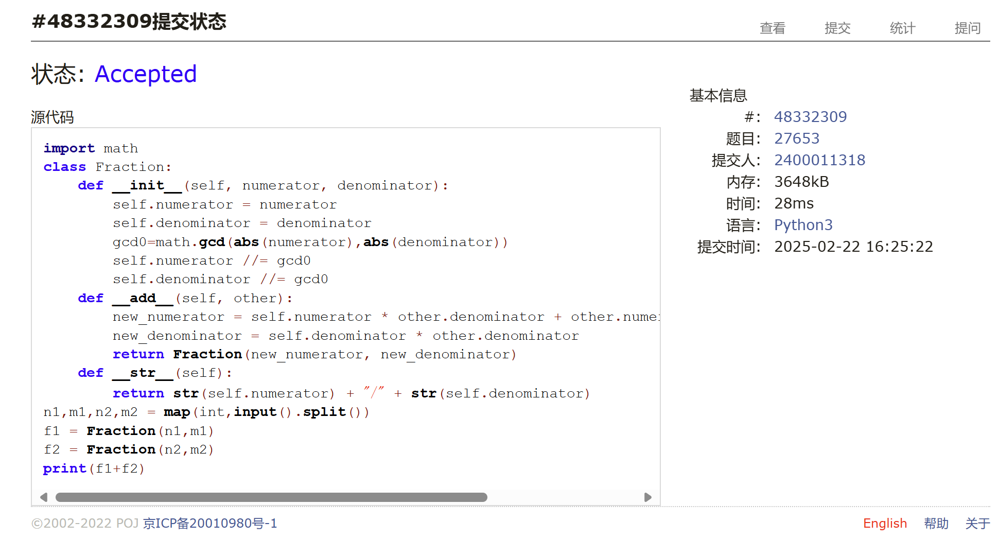
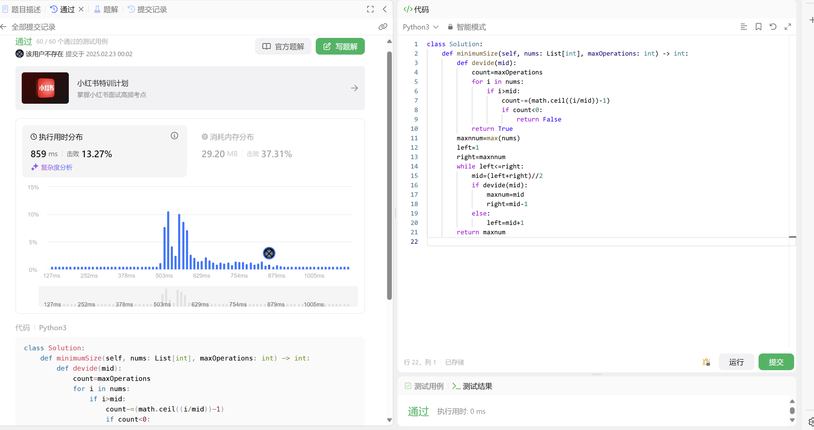
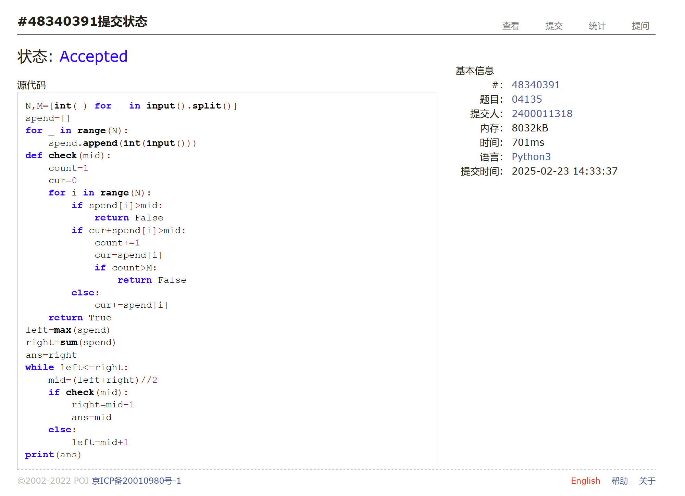
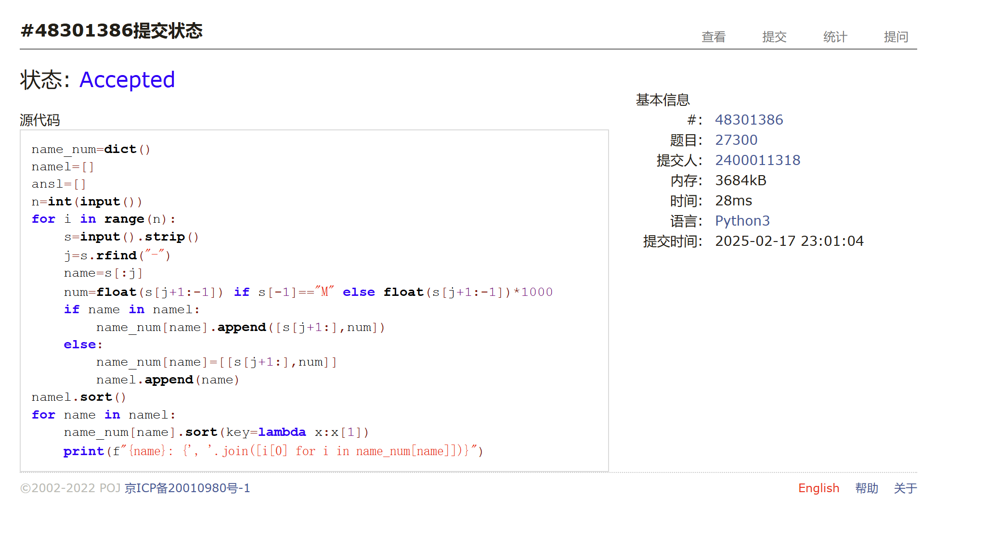
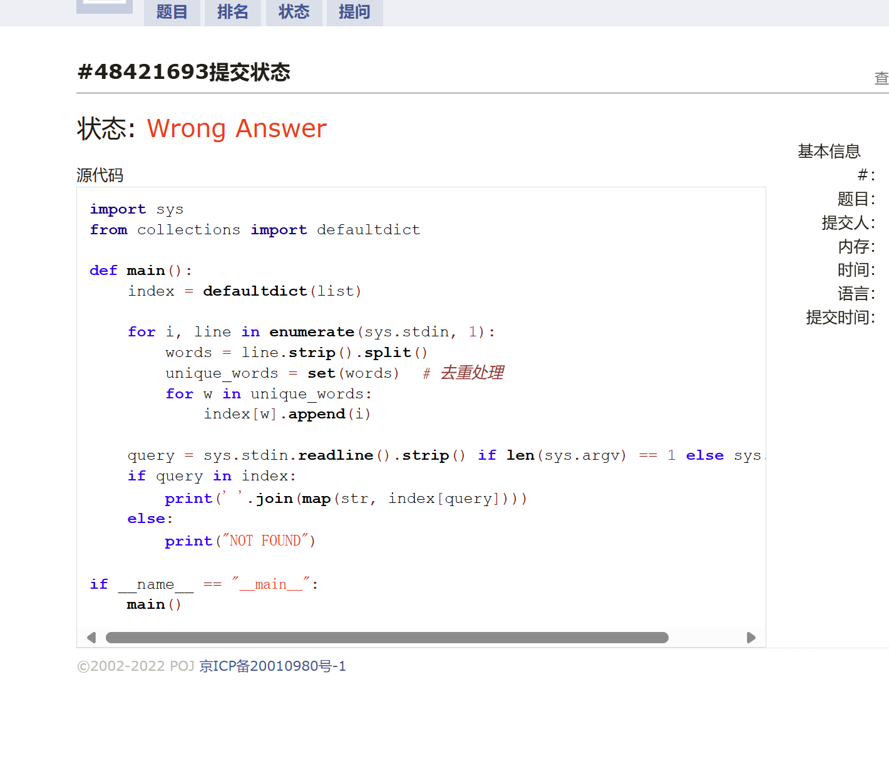
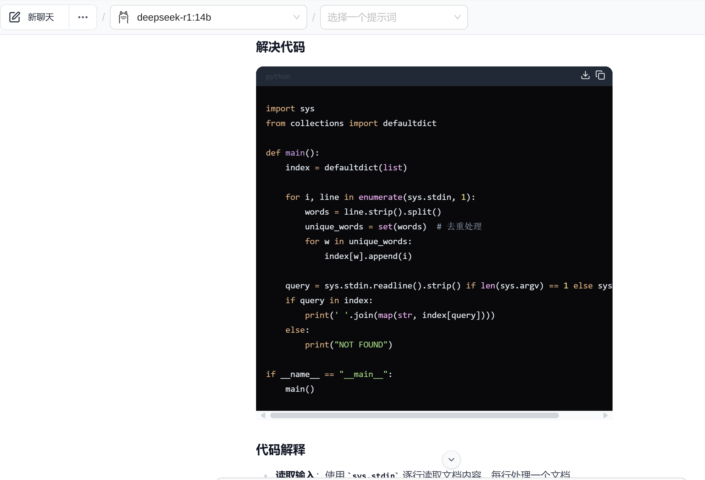
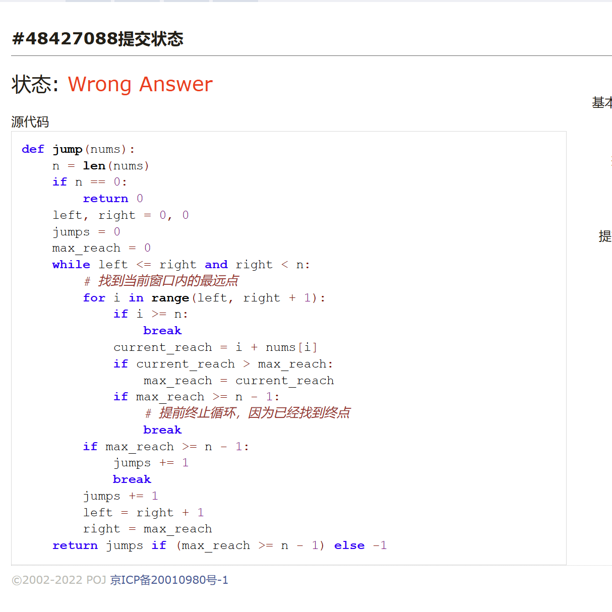

# Assignment #1: 虚拟机，Shell & 大语言模型

Updated 2309 GMT+8 Feb 20, 2025

2025 spring, Complied by  周博文——物理学院

## 1. 题目

### 27653: Fraction类

http://cs101.openjudge.cn/practice/27653/


思路：

创建类Fraction，分别存储分子分母并约分，重载+运算符，相加时通分后得到一个约分后的新分数，输出时以分数形式输出。

代码：

```python
import math
class Fraction:
    def __init__(self, numerator, denominator):
        self.numerator = numerator
        self.denominator = denominator
        gcd0=math.gcd(abs(numerator),abs(denominator))
        self.numerator //= gcd0
        self.denominator //= gcd0
    def __add__(self, other):
        new_numerator = self.numerator * other.denominator + other.numerator * self.denominator
        new_denominator = self.denominator * other.denominator
        return Fraction(new_numerator, new_denominator)
    def __str__(self):
        return str(self.numerator) + "/" + str(self.denominator)
n1,m1,n2,m2 = map(int,input().split())
f1 = Fraction(n1,m1)
f2 = Fraction(n2,m2)
print(f1+f2)
```


代码运行截图 <mark>（至少包含有"Accepted"）</mark>



### 1760.袋子里最少数目的球

 https://leetcode.cn/problems/minimum-limit-of-balls-in-a-bag/


思路：
在1和数组最大值之间进行二分查找，查找最小的能通过maxOperations分割得到的单个袋子最多的球数，判断能否分割得出是通过对每个袋中球数目大于mid的袋子进行分割，判断总分割次数是否小于等于maxOperations，如果小于等于则说明mid过大，需要减小mid，反之则说明mid过小，需要增大mid，最后返回mid即可。
*力扣官方题解采用了sum((x - 1) // y for x in nums)来判断是否可分割而没有定义函数，导致虽然复杂度都是logN但是耗时更少*
代码：

```python
class Solution:
    def minimumSize(self, nums: List[int], maxOperations: int) -> int:
        def devide(mid):
            count=maxOperations
            for i in nums:
                if i>mid:
                    count-=(math.ceil((i/mid))-1)
                    if count<0:
                        return False
            return True
        maxnnum=max(nums)
        left=1
        right=maxnnum
        while left<=right:
            mid=(left+right)//2
            if devide(mid):
                maxnum=mid
                right=mid-1
            else:
                left=mid+1
        return maxnum

```


代码运行截图 <mark>（至少包含有"Accepted"）</mark>



### 04135: 月度开销

http://cs101.openjudge.cn/practice/04135


思路：
以单日最大金额、总金额为边界进行二分查找，查找最小的能通过maxOperations分割得到的单个袋子最多的球数，判断能否分割得出是通过对每个袋中球数目大于mid的袋子进行分割，判断总分割次数是否小于等于maxOperations，如果小于等于则说明mid过大，需要减小mid，反之则说明mid过小，需要增大mid，最后返回mid即可。    


代码：

```python
N,M=[int(_) for _ in input().split()]
spend=[]
for _ in range(N):
    spend.append(int(input()))
def check(mid):
    count=1
    cur=0
    for i in range(N):
        if spend[i]>mid:
            return False
        if cur+spend[i]>mid:
            count+=1
            cur=spend[i]
            if count>M:
                return False
        else:
            cur+=spend[i]
    return True
left=max(spend)
right=sum(spend)
ans=right
while left<=right:
    mid=(left+right)//2
    if check(mid):
        right=mid-1
        ans=mid
    else:
        left=mid+1
print(ans)
```


代码运行截图 <mark>（至少包含有"Accepted"）</mark>



### 27300: 模型整理

http://cs101.openjudge.cn/practice/27300/


思路：
对于每一行的输入，通过寻找“-”来分割模型名称和参数量，列表存储模型名称并创建字典存储模型名称和参数量的对应关系，如果该模型名称已经存在则将参数量添加到字典中，如果不存在则创建新的字典，最后根据排序后的模型名称列表，对字典中参数量进行排序并输出。


代码：

```python
name_num=dict()
namel=[]
ansl=[]
n=int(input())
for i in range(n):
    s=input().strip()
    j=s.rfind("-")
    name=s[:j]
    num=float(s[j+1:-1]) if s[-1]=="M" else float(s[j+1:-1])*1000
    if name in namel:
        name_num[name].append([s[j+1:],num])
    else:
        name_num[name]=[[s[j+1:],num]]
        namel.append(name)
namel.sort()
for name in namel:
    name_num[name].sort(key=lambda x:x[1])
    print(f"{name}: {', '.join([i[0] for i in name_num[name]])}")
```


代码运行截图 <mark>（至少包含有"Accepted"）</mark>




### Q5. 大语言模型（LLM）部署与测试
云虚拟机进行了初步尝试，但因为时间原因，只初步了解了基本的命令和vim文本编辑，暂时没有尝试云端部署大模型；由于当时尚不知道作业形式，故未截图。

本地部署ollama与lmstudio均有尝试，本机配置i9-13900h，32G内存，显卡RTX4060 8G，尝试了deepseek-r1-distilled-7b/14b/32b，7b和14b运行情况较好，32b尝试时，ollma官方提供的下载链接出现进度条在10%附近波动的情况，尝试导入成功；但是发现，无论采用哪种方式，32b因超过GPU内存而分配了大量共享内存，大部分运算采用cpu且gpu占用率远低于7b/14b时，因此生成速率极其慢在2tokens每秒上下

但是，在14b模型的尝试中，发现编程效果很差，且每次生成至少耗时十分钟甚至30分钟；
根据我先前尝试让14b模型做物理题的尝试中，发现假如思维链过长时，大模型会忘了原来要他解的题，自己编一道题解决；这也可能与采用的模型版本有关，暂不清楚其原因





### Q6. 阅读《Build a Large Language Model (From Scratch)》第一章

作者：Sebastian Raschka

由于之前已经在3b1b的视频中有所了解，加上在物理学院举办的大模型微调比赛中有了初步尝试（虽然后来因时间忙，靠同组大佬带飞，并没有学的很深入），第一章所说的内容之前基本了解。

后面希望能加深对大模型架构的具体细节的认识和理解（目前只有粗略印象），以及了解一下，假如要深入学习相关内容，需要学习哪些前置知识；由于受种种因素影响，个人对类脑计算比较感兴趣，尤其是听学长说目前的llm以及当下的其他人工智能模型都与一开始模拟人脑的技术路线相去甚远，想要了解一下，有没有什么目前研究方向在采用模拟生物大脑或神经系统的技术路线？这样的路线有发展前景吗。

## 2. 学习总结和个人收获

寒假里做了热题100中的近一半（选做了部分有初步了解的模块，和几个较陌生模块的简单题和部分中等题）；开学后完成了部分每日选做，但进度落后于计划（物院作业太多了wwww）

上学期的计概课中，我所在的班级讲授内容大概涵盖了正常的计概内容并补充了dfs、贪心和少量dp，同时也简单讲述了oop和爬虫等技术，但讲授相对较浅。

目前学习下来，对其他的数据结构或算法有了初步了解，能够进行应用；但是，对于其应用的熟练度尚且不足，尤其是由于对python自带的一些库的函数和语法不熟悉，相对于最优方案往往要多很多行代码来实现功能（哪怕思路相同，代码易读性和简洁性有很大的不足），过于繁琐；同时，对于bfs等算法的应用意识还不够（也就是该用不知道要用）；另外，对于部分tough题和少量midium题尚且不能自行完成，要求助ai，还是有很大提升空间的。

以上。