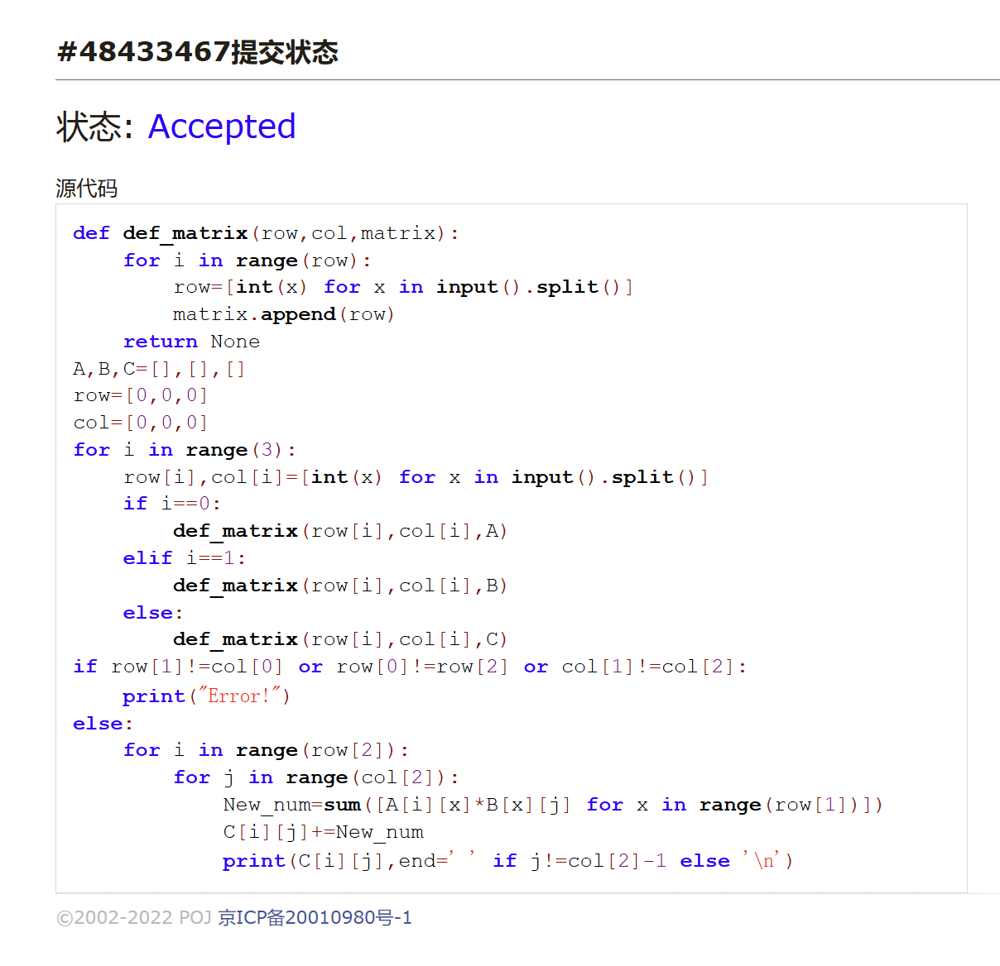
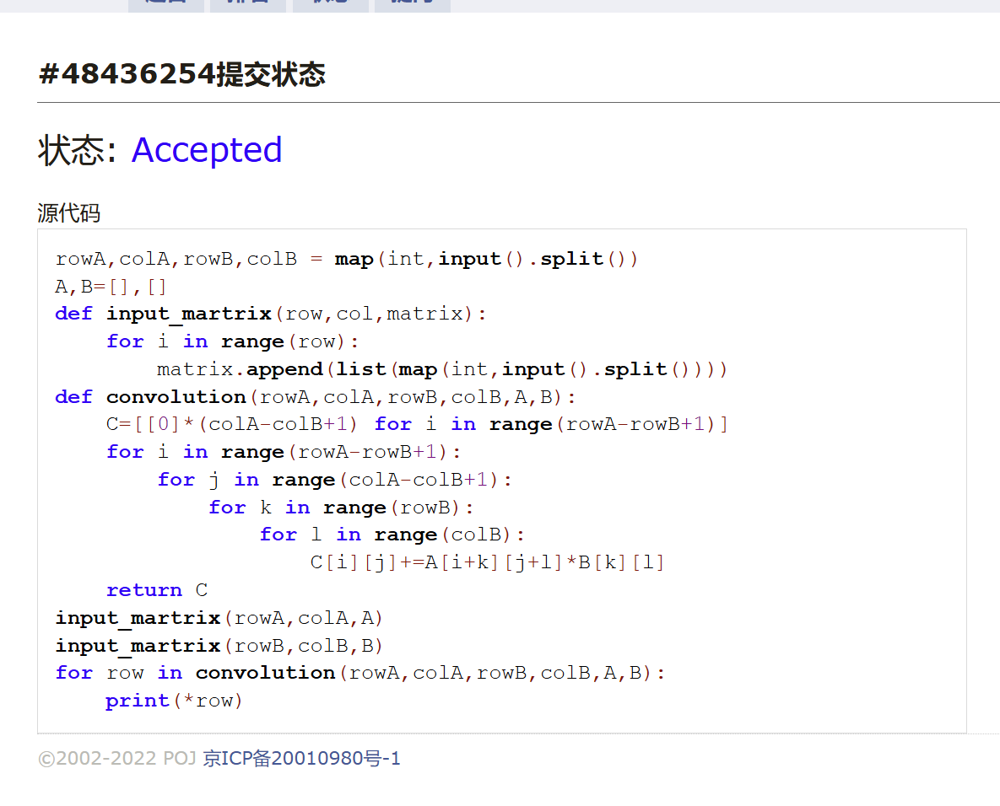
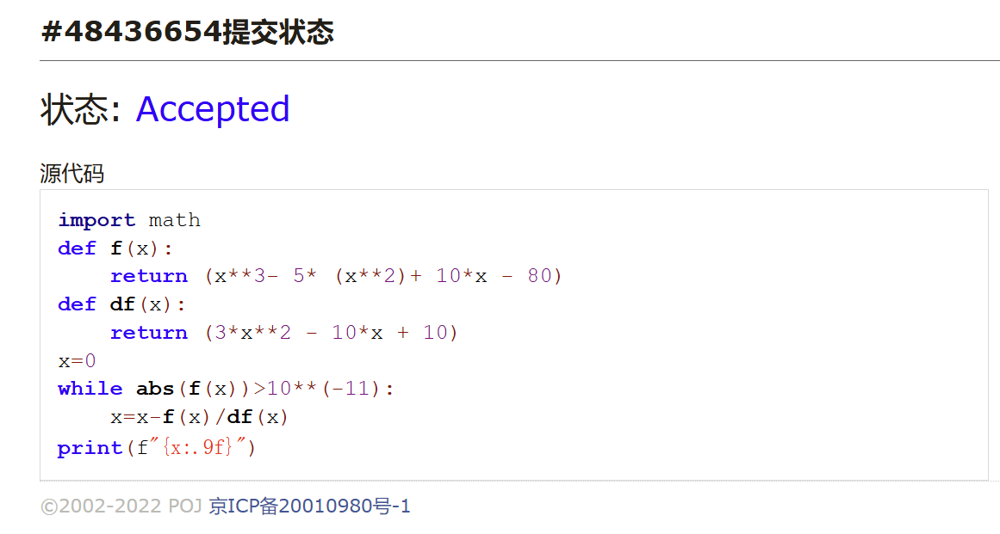
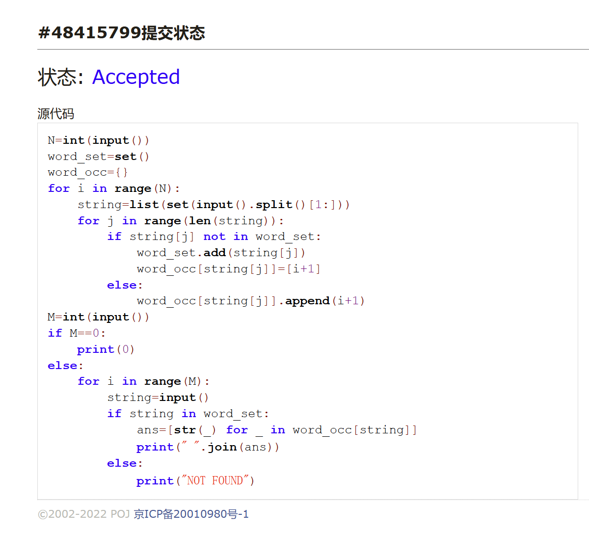
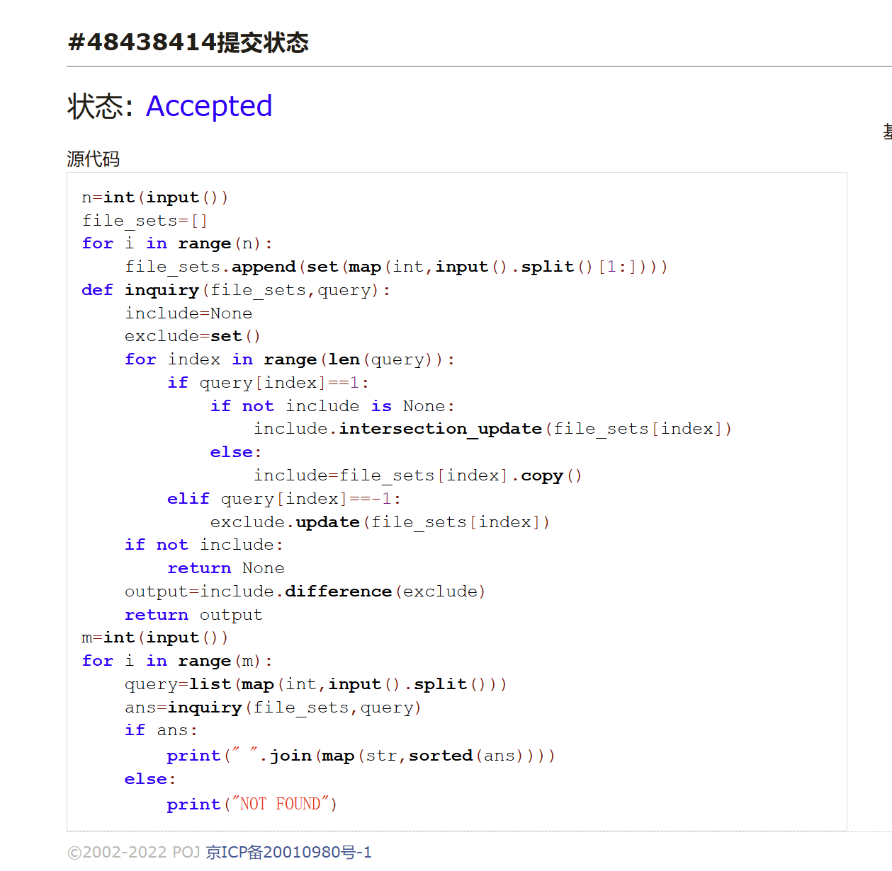
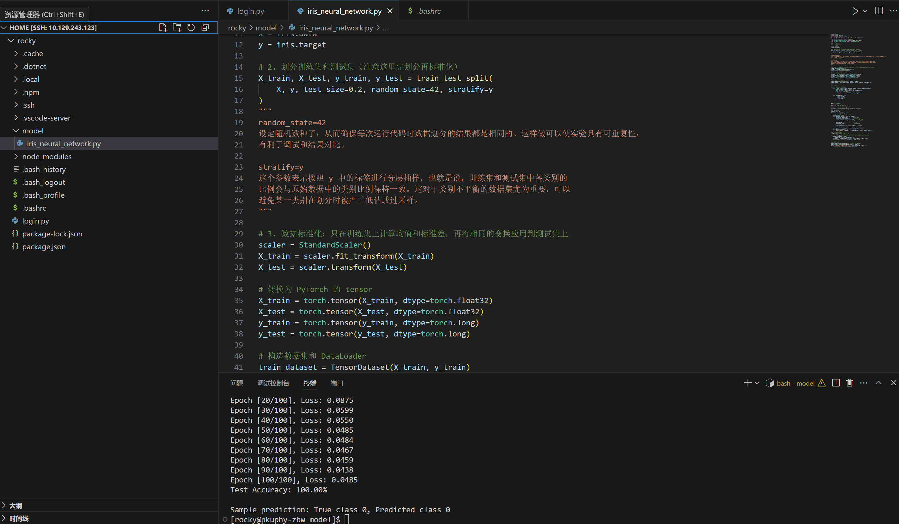

# Assignment #2: 深度学习与大语言模型

Updated 2204 GMT+8 Feb 25, 2025

2025 spring, Complied by <周博文——物理学院


**作业的各项评分细则及对应的得分**

| 标准                                 | 等级                                                         | 得分 |
| ------------------------------------ | ------------------------------------------------------------ | ---- |
| 按时提交                             | 完全按时提交：1分<br/>提交有请假说明：0.5分<br/>未提交：0分  | 1 分 |
| 源码、耗时（可选）、解题思路（可选） | 提交了4个或更多题目且包含所有必要信息：1分<br/>提交了2个或以上题目但不足4个：0.5分<br/>少于2个：0分 | 1 分 |
| AC代码截图                           | 提交了4个或更多题目且包含所有必要信息：1分<br/>提交了2个或以上题目但不足4个：0.5分<br/>少于：0分 | 1 分 |
| 清晰头像、PDF文件、MD/DOC附件        | 包含清晰的Canvas头像、PDF文件以及MD或DOC格式的附件：1分<br/>缺少上述三项中的任意一项：0.5分<br/>缺失两项或以上：0分 | 1 分 |
| 学习总结和个人收获                   | 提交了学习总结和个人收获：1分<br/>未提交学习总结或内容不详：0分 | 1 分 |
| 总得分： 5                           | 总分满分：5分                                                |      |
>
> 
>
> **说明：**
>
> 1. **解题与记录：**
>       - 对于每一个题目，请提供其解题思路（可选），并附上使用Python或C++编写的源代码（确保已在OpenJudge， Codeforces，LeetCode等平台上获得Accepted）。请将这些信息连同显示“Accepted”的截图一起填写到下方的作业模板中。（推荐使用Typora https://typoraio.cn 进行编辑，当然你也可以选择Word。）无论题目是否已通过，请标明每个题目大致花费的时间。
>    
>2. **课程平台与提交安排：**
> 
>   - 我们的课程网站位于Canvas平台（https://pku.instructure.com ）。该平台将在第2周选课结束后正式启用。在平台启用前，请先完成作业并将作业妥善保存。待Canvas平台激活后，再上传你的作业。
> 
>       - 提交时，请首先上传PDF格式的文件，并将.md或.doc格式的文件作为附件上传至右侧的“作业评论”区。确保你的Canvas账户有一个清晰可见的头像，提交的文件为PDF格式，并且“作业评论”区包含上传的.md或.doc附件。
> 
>3. **延迟提交：**
> 
>   - 如果你预计无法在截止日期前提交作业，请提前告知具体原因。这有助于我们了解情况并可能为你提供适当的延期或其他帮助。 
> 
>请按照上述指导认真准备和提交作业，以保证顺利完成课程要求。


## 1. 题目

### 18161: 矩阵运算

matrices, http://cs101.openjudge.cn/practice/18161


思路：

先定义函数，辅助定义A，B，C三个矩阵，然后验证各个矩阵的行列数目是否合法，最后直接输出i，j位置上，A*B+C对应元素的值

代码：

```python
def def_matrix(row,col,matrix):
    for i in range(row):
        row=[int(x) for x in input().split()]
        matrix.append(row)
    return None
A,B,C=[],[],[]
row=[0,0,0]
col=[0,0,0]
for i in range(3):
    row[i],col[i]=[int(x) for x in input().split()]
    if i==0:
        def_matrix(row[i],col[i],A)
    elif i==1:
        def_matrix(row[i],col[i],B)
    else:
        def_matrix(row[i],col[i],C)
if row[1]!=col[0] or row[0]!=row[2] or col[1]!=col[2]:
    print("Error!")
else:
    for i in range(row[2]):
        for j in range(col[2]):
            New_num=sum([A[i][x]*B[x][j] for x in range(row[1])])
            C[i][j]+=New_num
            print(C[i][j],end=' ' if j!=col[2]-1 else '\n')
```


代码运行截图 <mark>（至少包含有"Accepted"）</mark>




### 19942: 二维矩阵上的卷积运算

matrices, http://cs101.openjudge.cn/practice/19942/


思路：

先定义函数，辅助定义A，B两个矩阵，创建卷积函数，输出一个新矩阵，遍历该矩阵的每个位置，计算卷积值，使得其元素为对应的值

代码：

```python
rowA,colA,rowB,colB = map(int,input().split())
A,B=[],[]
def input_martrix(row,col,matrix):
    for i in range(row):
        matrix.append(list(map(int,input().split())))
def convolution(rowA,colA,rowB,colB,A,B):
    C=[[0]*(colA-colB+1) for i in range(rowA-rowB+1)]
    for i in range(rowA-rowB+1):
        for j in range(colA-colB+1):
            for k in range(rowB):
                for l in range(colB):
                    C[i][j]+=A[i+k][j+l]*B[k][l]
    return C
input_martrix(rowA,colA,A)
input_martrix(rowB,colB,B)
for row in convolution(rowA,colA,rowB,colB,A,B):
    print(*row)
```


代码运行截图 <mark>（至少包含有"Accepted"）</mark>




### 04140: 方程求解

牛顿迭代法，http://cs101.openjudge.cn/practice/04140/

请用<mark>牛顿迭代法</mark>实现。

因为大语言模型的训练过程中涉及到了梯度下降（或其变种，如SGD、Adam等），用于优化模型参数以最小化损失函数。两种方法都是通过迭代的方式逐步接近最优解。每一次迭代都基于当前点的局部信息调整参数，试图找到一个比当前点更优的新点。理解牛顿迭代法有助于深入理解基于梯度的优化算法的工作原理，特别是它们如何利用导数信息进行决策。

> **牛顿迭代法**
>
> - **目的**：主要用于寻找一个函数 $f(x)$ 的根，即找到满足 $f(x)=0$ 的 $x$ 值。不过，通过适当变换目标函数，它也可以用于寻找函数的极值。
> - **方法基础**：利用泰勒级数的一阶和二阶项来近似目标函数，在每次迭代中使用目标函数及其导数的信息来计算下一步的方向和步长。
> - **迭代公式**：$ x_{n+1} = x_n - \frac{f(x_n)}{f'(x_n)} $ 对于求极值问题，这可以转化为$ x_{n+1} = x_n - \frac{f'(x_n)}{f''(x_n)} $，这里 $f'(x)$ 和 $f''(x)$ 分别是目标函数的一阶导数和二阶导数。
> - **特点**：牛顿法通常具有更快的收敛速度（尤其是对于二次可微函数），但是需要计算目标函数的二阶导数（Hessian矩阵在多维情况下），并且对初始点的选择较为敏感。
>
> **梯度下降法**
>
> - **目的**：直接用于寻找函数的最小值（也可以通过取负寻找最大值），尤其在机器学习领域应用广泛。
> - **方法基础**：仅依赖于目标函数的一阶导数信息（即梯度），沿着梯度的反方向移动以达到减少函数值的目的。
> - **迭代公式**：$ x_{n+1} = x_n - \alpha \cdot \nabla f(x_n) $ 这里 $\alpha$ 是学习率，$\nabla f(x_n)$ 表示目标函数在 $x_n$ 点的梯度。
> - **特点**：梯度下降不需要计算复杂的二阶导数，因此在高维空间中相对容易实现。然而，它的收敛速度通常较慢，特别是当目标函数的等高线呈现出椭圆而非圆形时（即存在条件数大的情况）。
>
> **相同与不同**
>
> - **相同点**：两者都可用于优化问题，试图找到函数的极小值点；都需要目标函数至少一阶可导。
> - **不同点**：
>   - 牛顿法使用了更多的局部信息（即二阶导数），因此理论上收敛速度更快，但在实际应用中可能会遇到计算成本高、难以处理大规模数据集等问题。
>   - 梯度下降则更为简单，易于实现，特别是在高维空间中，但由于只使用了一阶导数信息，其收敛速度可能较慢，尤其是在接近极值点时。
>


代码：

```python
import math
def f(x):
    return (x**3- 5* (x**2)+ 10*x - 80)
def df(x):
    return (3*x**2 - 10*x + 10)
x=0
while abs(f(x))>10**(-11):
    x=x-f(x)/df(x)
print(f"{x:.9f}")
```


代码运行截图 <mark>（至少包含有"Accepted"）</mark>




### 06640: 倒排索引

data structures, http://cs101.openjudge.cn/practice/06640/


思路：

用集合记录出现过的所有单词，创建以单词为键的字典，记录单词出现过的行数，根据查询的单词进行输出

代码：

```python                                     
N=int(input())
word_set=set()
word_occ={}
for i in range(N):
    string=list(set(input().split()[1:]))
    for j in range(len(string)):
        if string[j] not in word_set:
            word_set.add(string[j])
            word_occ[string[j]]=[i+1]
        else:
            word_occ[string[j]].append(i+1)
M=int(input())
if M==0:
    print(0)
else:
    for i in range(M):
        string=input()
        if string in word_set:
            ans=[str(_) for _ in word_occ[string]] 
            print(" ".join(ans))
        else:
            print("NOT FOUND")
```


代码运行截图 <mark>（至少包含有"Accepted"）</mark>




### 04093: 倒排索引查询

data structures, http://cs101.openjudge.cn/practice/04093/


思路：

创建字典，记录每个数字出现过的文档，查询时根据1/-1/0，将值为1取交集，值为-1取并集，值为0的不处理，再取前者对于后者的差集，输出。

代码：

```python
n=int(input())
file_sets=[]
for i in range(n):
    file_sets.append(set(map(int,input().split()[1:])))
def inquiry(file_sets,query):
    include=None
    exclude=set()
    for index in range(len(query)):
        if query[index]==1:
            if not include is None:
                include.intersection_update(file_sets[index])
            else:
                include=file_sets[index].copy()
        elif query[index]==-1:
            exclude.update(file_sets[index])
    if not include:
        return None
    output=include.difference(exclude)
    return output
m=int(input())
for i in range(m):
    query=list(map(int,input().split()))
    ans=inquiry(file_sets,query)
    if ans:
        print(" ".join(map(str,sorted(ans))))
    else:
        print("NOT FOUND")
```


代码运行截图 <mark>（至少包含有"Accepted"）</mark>




### Q6. Neural Network实现鸢尾花卉数据分类

在http://clab.pku.edu.cn 云端虚拟机，用Neural Network实现鸢尾花卉数据分类。

参考链接，https://github.com/GMyhf/2025spring-cs201/blob/main/LLM/iris_neural_network.md


成功按照参考链接的代码，利用vscode的ssh插件在云端虚拟机中成功运行，未遇到难以解决的问题


## 2. 学习总结和个人收获

因为交作业时间间隔太短，暂时没有太多新的感受，会在作业3中总结近期学习情况。