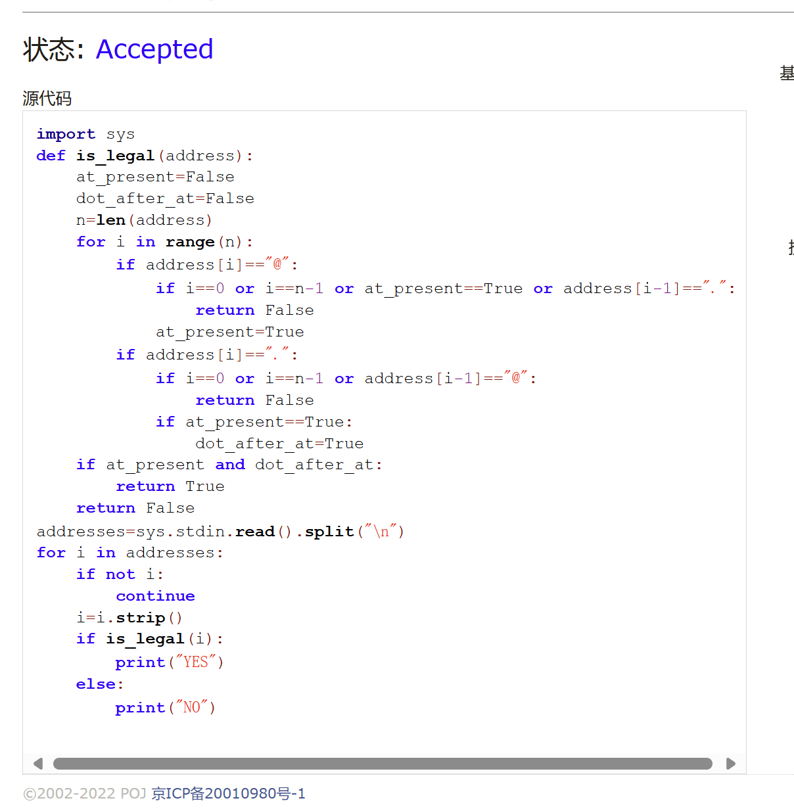
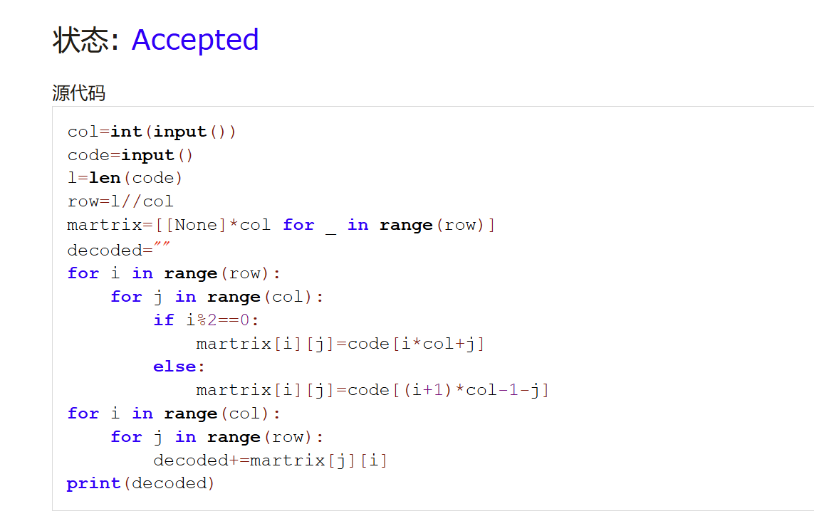
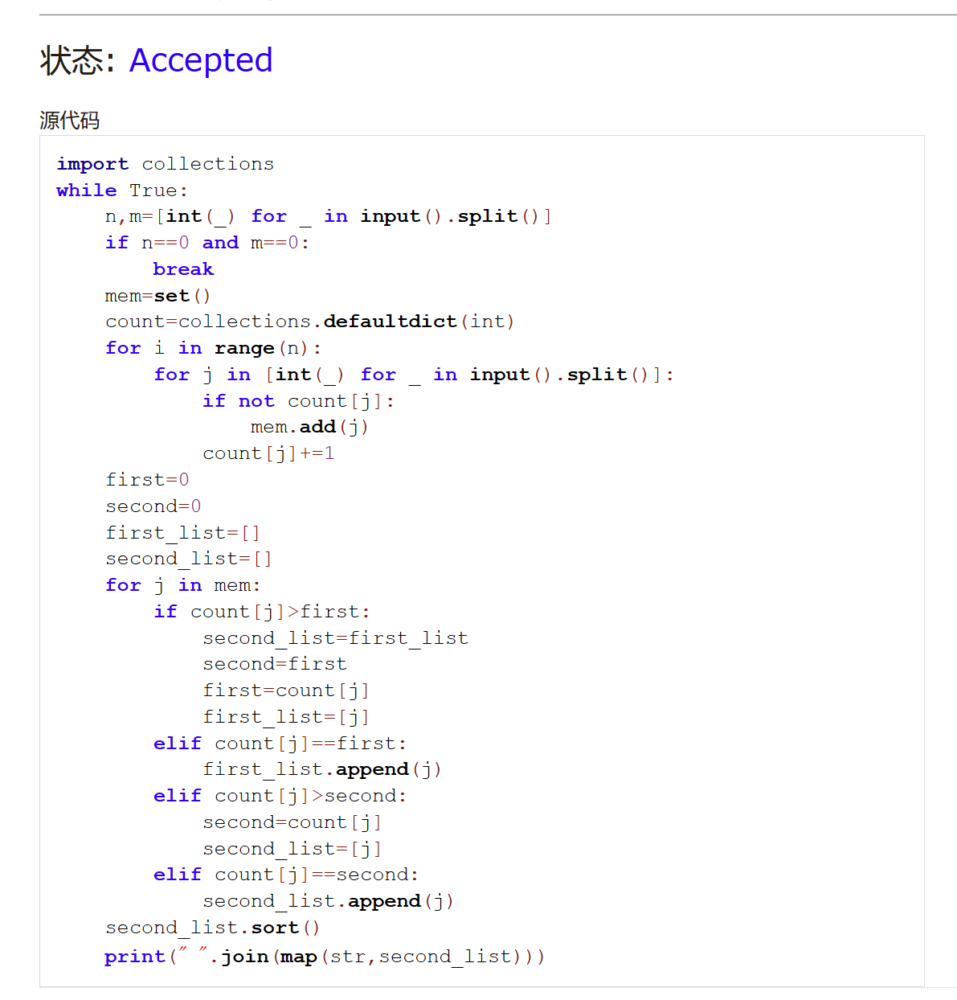
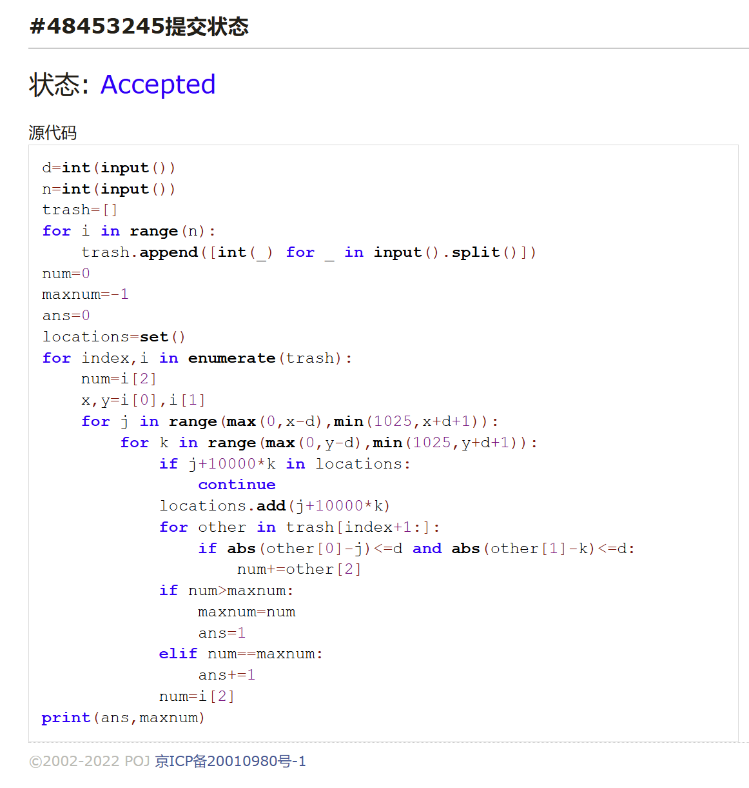
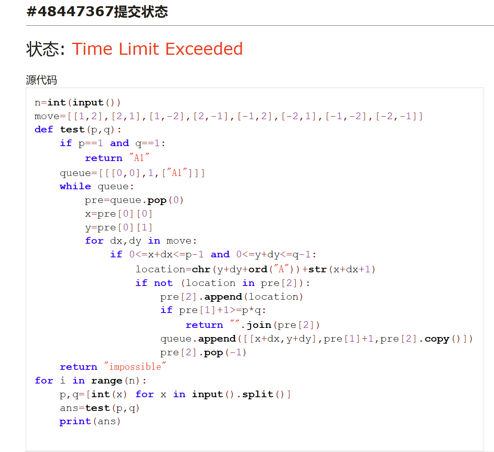
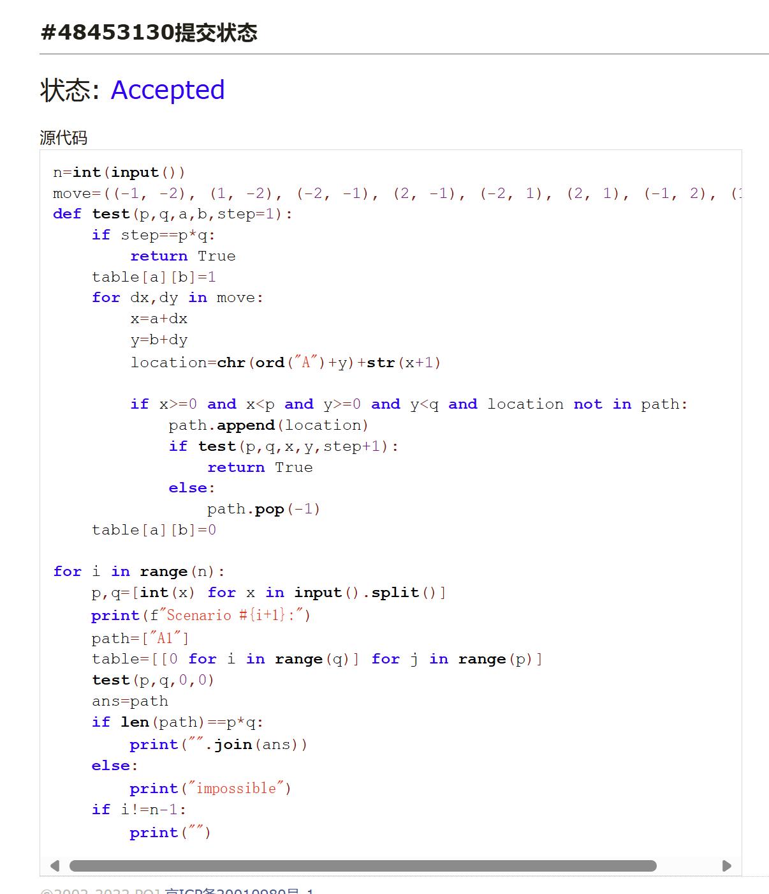
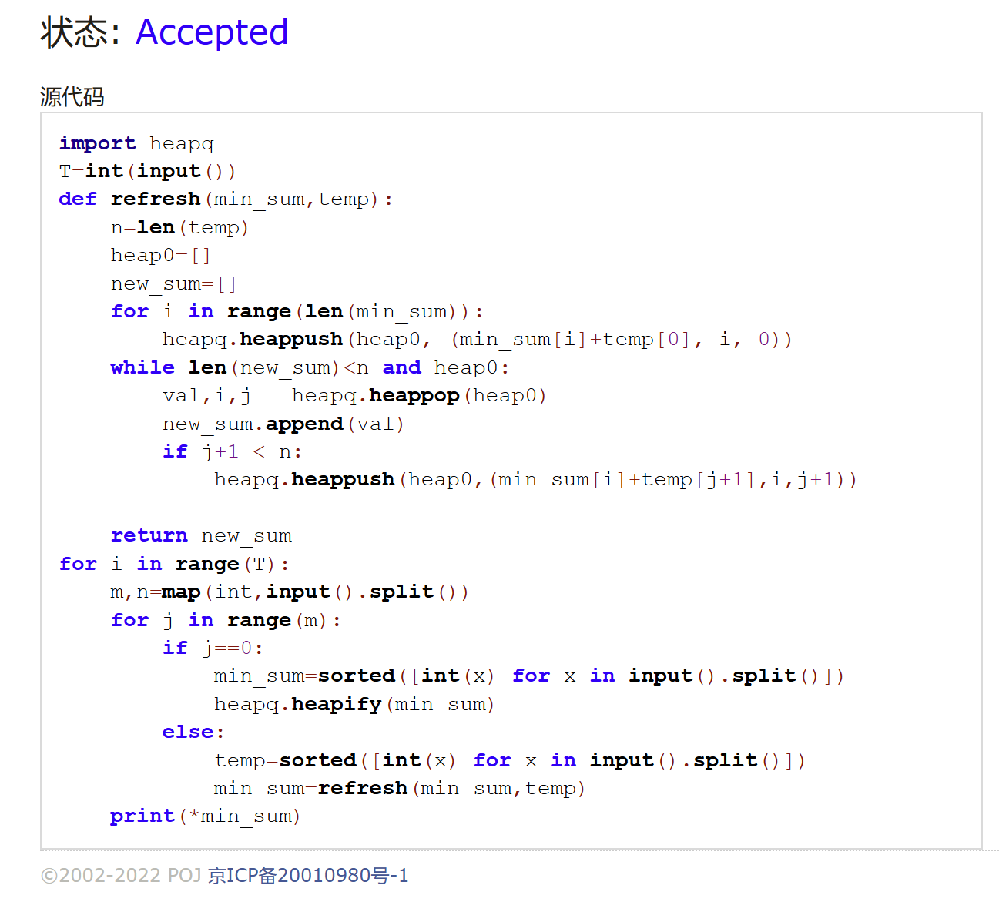

# Assignment #3: 惊蛰 Mock Exam

Updated 1641 GMT+8 Mar 5, 2025

2025 spring, Complied by 周博文——物理学院


> **说明：**
>
> 1. **惊蛰⽉考**：AC3<mark>（请改为同学的通过数）</mark> 。考试题⽬都在“题库（包括计概、数算题目）”⾥⾯，按照数字题号能找到，可以重新提交。作业中提交⾃⼰最满意版本的代码和截图。
>
> 2. **解题与记录：**
>
>    对于每一个题目，请提供其解题思路（可选），并附上使用Python或C++编写的源代码（确保已在OpenJudge， Codeforces，LeetCode等平台上获得Accepted）。请将这些信息连同显示“Accepted”的截图一起填写到下方的作业模板中。（推荐使用Typora https://typoraio.cn 进行编辑，当然你也可以选择Word。）无论题目是否已通过，请标明每个题目大致花费的时间。
>
> 3. **提交安排：**提交时，请首先上传PDF格式的文件，并将.md或.doc格式的文件作为附件上传至右侧的“作业评论”区。确保你的Canvas账户有一个清晰可见的头像，提交的文件为PDF格式，并且“作业评论”区包含上传的.md或.doc附件。
>
> 4. **延迟提交：**如果你预计无法在截止日期前提交作业，请提前告知具体原因。这有助于我们了解情况并可能为你提供适当的延期或其他帮助。 
>
> 请按照上述指导认真准备和提交作业，以保证顺利完成课程要求。


## 1. 题目

### E04015: 邮箱验证

strings, http://cs101.openjudge.cn/practice/04015


思路：

之前没做过，卡了很久。。。
浪费了将近一个小时，各种细节问题。。。做这种题一定要一一核对题干中的内容，不要想当然！
考场上还犯了一个问题，由于之前没有尝试过在终端手动进行sys.stdin.read()写法的输入，导致WA后无法看输出找错误，试了好几分钟才知道ctrl+Z能结束输入，浪费了时间
代码：

```python
import sys 
def is_legal(address):
    at_present=False
    dot_after_at=False
    n=len(address)
    for i in range(n):
        if address[i]=="@":
            if i==0 or i==n-1 or at_present==True or address[i-1]==".":
                return False
            at_present=True
        if address[i]==".":
            if i==0 or i==n-1 or address[i-1]=="@":
                return False
            if at_present==True:
                dot_after_at=True
    if at_present and dot_after_at:
        return True
    return False
addresses=sys.stdin.read().split("\n")
for i in addresses:
    if not i:
        continue
    i=i.strip()
    if is_legal(i):
        print("YES")
    else:
        print("NO")

```


代码运行截图 <mark>（至少包含有"Accepted"）</mark>




### M02039: 反反复复

implementation, http://cs101.openjudge.cn/practice/02039/


思路：

模拟题干中的过程即可，比较简单

代码：

```python
col=int(input())
code=input()
l=len(code)
row=l//col
martrix=[[None]*col for _ in range(row)]
decoded=""
for i in range(row):
    for j in range(col):
        if i%2==0:
            martrix[i][j]=code[i*col+j]
        else:
            martrix[i][j]=code[(i+1)*col-1-j]
for i in range(col):
    for j in range(row):
        decoded+=martrix[j][i]
print(decoded)
```


代码运行截图 <mark>（至少包含有"Accepted"）</mark>




### M02092: Grandpa is Famous

implementation, http://cs101.openjudge.cn/practice/02092/


思路：

难点主要在于题干看不懂，不得不求助了翻译软件（不知道考试会不会有英文题）。。。
思路是创建一个字典，key为编号，value为出现次数，然后遍历出现过的编号，动态维护出现次数最多、次多的人的序号以及出现次数，输出结果。

代码：

```python
import collections
while True:
    n,m=[int(_) for _ in input().split()]
    if n==0 and m==0:
        break
    mem=set()
    count=collections.defaultdict(int)
    for i in range(n):
        for j in [int(_) for _ in input().split()]:
            if not count[j]:
                mem.add(j)
            count[j]+=1
    first=0
    second=0
    first_list=[]
    second_list=[]
    for j in mem:
        if count[j]>first:
            second_list=first_list
            second=first
            first=count[j]
            first_list=[j]
        elif count[j]==first:
            first_list.append(j)
        elif count[j]>second:
            second=count[j]
            second_list=[j]
        elif count[j]==second:
            second_list.append(j)
    second_list.sort()
    print(" ".join(map(str,second_list)))
```




代码运行截图 <mark>（至少包含有"Accepted"）</mark>


### M04133: 垃圾炸弹

matrices, http://cs101.openjudge.cn/practice/04133/


思路：

血压题！！！思路完全正确，但细节上写法有问题，导致一直WA，最后也没调出来

思路是由前往后遍历各个垃圾附近距离为d的每个格子，分别求这个格子放炸弹能消灭多少垃圾，整体思路还是比较简单的

为了避免重复和节约时间，采用locations记录已经查询的格子，同时因为数组不能用in来判断是否在set中，所以进行编码为y*10000+x来记录；同时，在后续垃圾为中心的计算中，不考虑已经被选取为中心过的垃圾，可以节省时间

<strong>问题在于,要注意考察的放炸弹的位置要在0-1024之间（否则会多解），考试过程中一直没有检查出来。。。；同时，最好注意一开始的maxnum最好设为-1，防止各点垃圾数目全为0时会出现错误答案（尽管样例中可能没有体现）</strong>

代码：

```python
d=int(input())
n=int(input())
trash=[]
for i in range(n):
    trash.append([int(_) for _ in input().split()])
num=0
maxnum=-1
ans=0
locations=set()
for index,i in enumerate(trash):
    num=i[2]
    x,y=i[0],i[1]
    for j in range(max(0,x-d),min(1025,x+d+1)):
        for k in range(max(0,y-d),min(1025,y+d+1)):
            if j+10000*k in locations:
                continue
            locations.add(j+10000*k)
            for other in trash[index+1:]:
                if abs(other[0]-j)<=d and abs(other[1]-k)<=d:
                    num+=other[2]
            if num>maxnum:
                maxnum=num
                ans=1
            elif num==maxnum:
                ans+=1
            num=i[2]
print(ans,maxnum)
```


代码运行截图 <mark>（至少包含有"Accepted"）</mark>




### T02488: A Knight's Journey

backtracking, http://cs101.openjudge.cn/practice/02488/


思路：

思路是遍历所有可能的走法，然后判断是否能够走完，如果能够走完，则输出结果，否则输出impossible

但是，一开始采用了类似于bfs的写法，遂超时。。。（不解为何这种写法和后来能过的答案时间复杂度上有何区别，还请老师解答）（虽然还有其他的问题）（见下）

重写后不超时了，且基本正确，开始debug：
首先是格式，注意审题！其次是字典序的理解，一开始是没看到字典序，后来是x，y顺序搞反，尽管样例能过但还是WA，感谢群里同学的帮助
还有一些优化：采用全局变量path数组来记录和改变路径，而不是每次copy，节省时间；同时采用table来记录已经走过的格子和回溯，而不是一直in in in，节约时间；还改变了编码方式，处理过程中用数字坐标编码而非“A1”这种，能让程序本身简洁一点

<mark>下面为初始错误代码，通过的代码见于在下面一张图！</mark>


代码：

```python
n=int(input())
move=((-1, -2), (1, -2), (-2, -1), (2, -1), (-2, 1), (2, 1), (-1, 2), (1, 2))
def test(p,q,a,b,step=1):
    if step==p*q:
        return True
    table[a][b]=1
    for dx,dy in move:
        x=a+dx
        y=b+dy
        if x>=0 and x<p and y>=0 and y<q and table[x][y]==0:
            path.append([x,y])
            if test(p,q,x,y,step+1):
                return True
            else:
                path.pop(-1)
    table[a][b]=0
        
for i in range(n):
    p,q=[int(x) for x in input().split()]
    print(f"Scenario #{i+1}:")
    path=[[0,0]]
    table=[[0 for i in range(q)] for j in range(p)]
    test(p,q,0,0)
    ans=""
    if len(path)==p*q:
        for x,y in path:
            ans+=chr(ord('A')+y)+str(x+1)
        print(ans)
    else:
        print("impossible")
    if i!=n-1:
        print("")
```


代码运行截图 <mark>（至少包含有"Accepted"）</mark>




### T06648: Sequence

heap, http://cs101.openjudge.cn/practice/06648/


思路：
最困难的一次，之前没学过堆，现学了一下发现还是不会；求助kimi，看了kimi的思路尝试自己写，但是既超时间又超空间；然后尝试剪枝，首先在更新minin_sum的过程中，内循环j范围改为range(n-i)，此时超空间不超时，然后再次剪枝，若min_sum[i]+temp[j]>min_sum[i-1]+temp[n-i]则断掉内循环，遂WA；无奈问deepseek求改进思路，学会了heapq能将元组塞入堆中并按字典序比大小，从而只有取出元素的时候，才会塞新元素，成功ac

代码：

```python
import heapq
T=int(input())
def refresh(min_sum,temp):
    n=len(temp)
    heap0=[]
    new_sum=[]
    for i in range(len(min_sum)):
        heapq.heappush(heap0, (min_sum[i]+temp[0], i, 0))
    while len(new_sum)<n and heap0:
        val,i,j = heapq.heappop(heap0)
        new_sum.append(val)
        if j+1 < n:
            heapq.heappush(heap0,(min_sum[i]+temp[j+1],i,j+1))
    return new_sum
for i in range(T):
    m,n=map(int,input().split())
    for j in range(m):
        if j==0:
            min_sum=sorted([int(x) for x in input().split()])
            heapq.heapify(min_sum)
        else:
            temp=sorted([int(x) for x in input().split()])
            min_sum=refresh(min_sum,temp)
    print(*min_sum)
```


代码运行截图 ==（AC代码截图，至少包含有"Accepted"）==



## 2. 学习总结和收获

月考六个题只对了3个，其中第一题过于不熟练浪费很长时间；第四题结束前做的，差了一两分钟没调完功败垂成。。。第五题有了大致思路，但是具体写法上存在问题，超时；第六题更是学都没学过。总结就是，需要补足知识点，同时多做题；同时，考试的时候一定要注意读题审题！！！假如能节约纯粹因为读题问题浪费的时间，ac4-5应该是没问题的；第六题确实不好做（）


