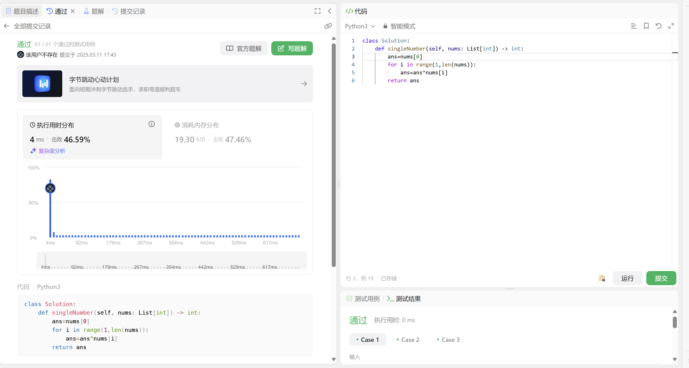
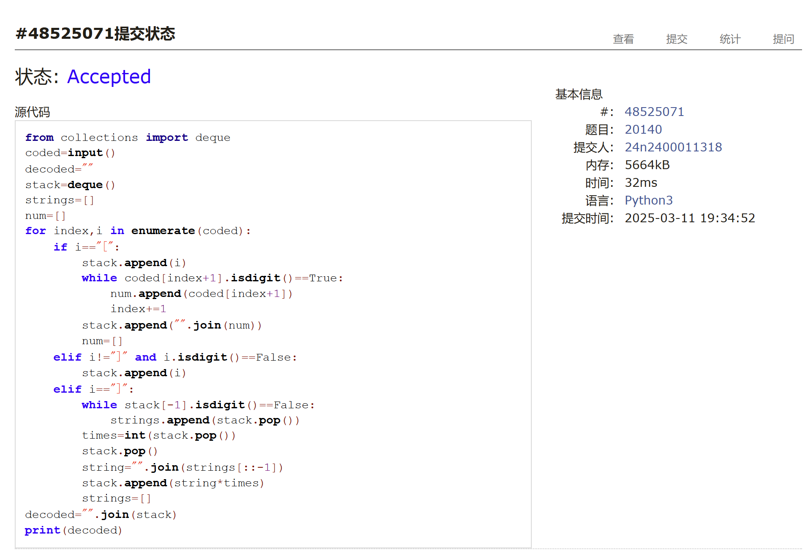
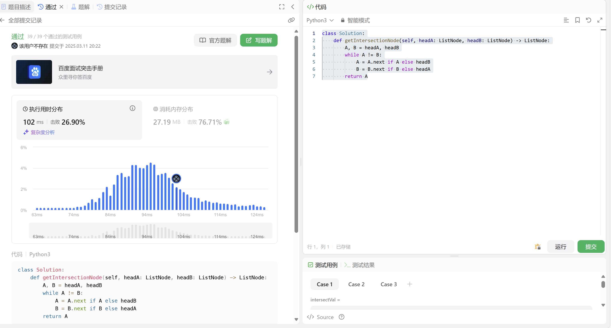
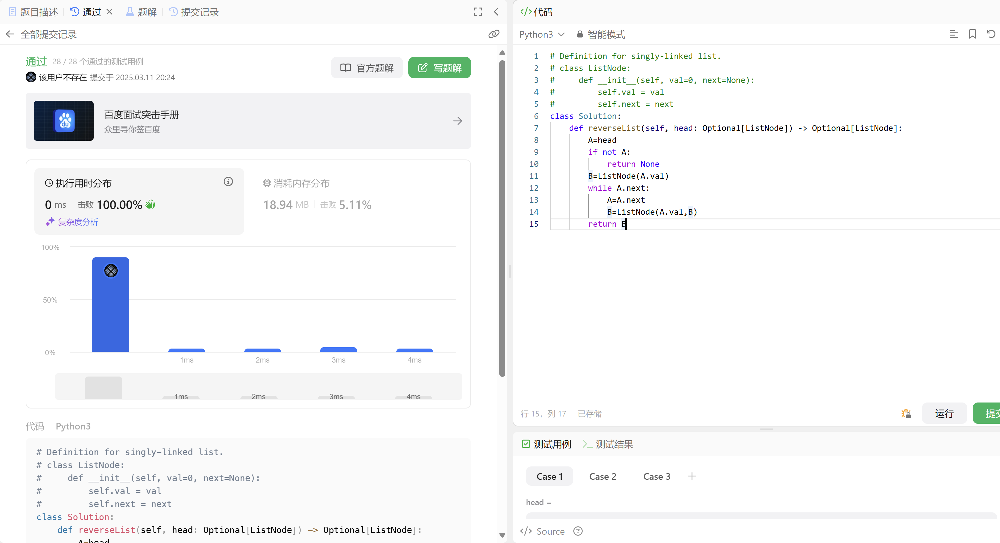
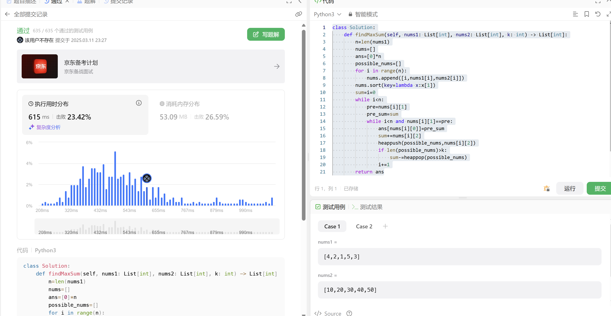
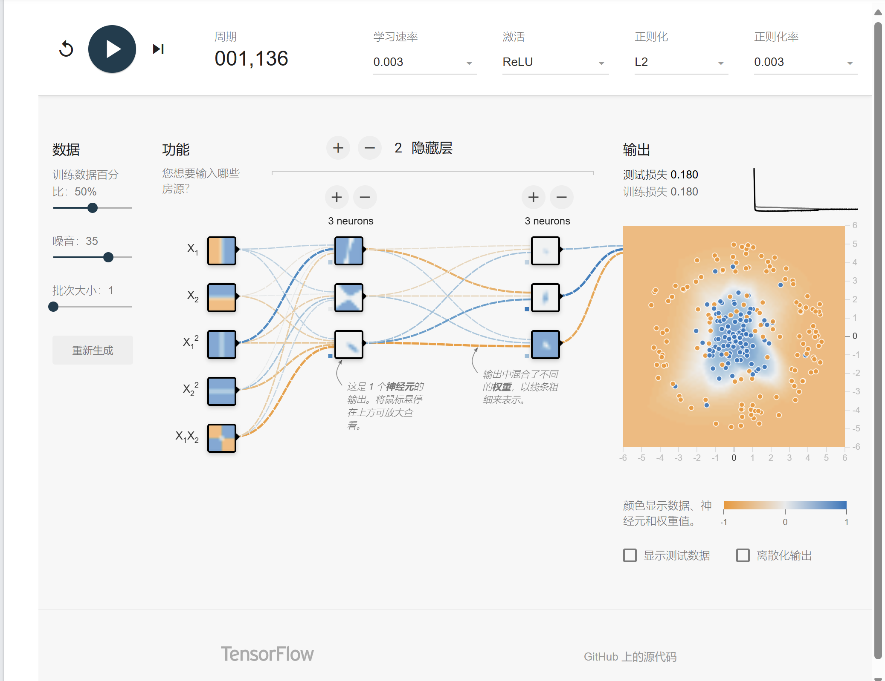

# Assignment #4: 位操作、栈、链表、堆和NN

Updated 1203 GMT+8 Mar 10, 2025

2025 spring, Complied by 周博文——物理学院


> **说明：**
>
> 1. **解题与记录：**
>
>    对于每一个题目，请提供其解题思路（可选），并附上使用Python或C++编写的源代码（确保已在OpenJudge， Codeforces，LeetCode等平台上获得Accepted）。请将这些信息连同显示“Accepted”的截图一起填写到下方的作业模板中。（推荐使用Typora https://typoraio.cn 进行编辑，当然你也可以选择Word。）无论题目是否已通过，请标明每个题目大致花费的时间。
>
> 2. **提交安排：**提交时，请首先上传PDF格式的文件，并将.md或.doc格式的文件作为附件上传至右侧的“作业评论”区。确保你的Canvas账户有一个清晰可见的头像，提交的文件为PDF格式，并且“作业评论”区包含上传的.md或.doc附件。
>
> 3. **延迟提交：**如果你预计无法在截止日期前提交作业，请提前告知具体原因。这有助于我们了解情况并可能为你提供适当的延期或其他帮助。 
>
> 请按照上述指导认真准备和提交作业，以保证顺利完成课程要求。


## 1. 题目

### 136.只出现一次的数字

bit manipulation, https://leetcode.cn/problems/single-number/


<mark>请用位操作来实现，并且只使用常量额外空间。</mark>


代码：

```python
class Solution:
    def singleNumber(self, nums: List[int]) -> int:
        ans=nums[0]
        for i in range(1,len(nums)):
            ans=ans^nums[i]
        return ans
```


代码运行截图 <mark>（至少包含有"Accepted"）</mark>




### 20140:今日化学论文

stack, http://cs101.openjudge.cn/practice/20140/


思路：
用一个deque()作为栈来逐字符存储，当遇到"["时，将其入栈并将后续的倍数的整体转化为字符串入栈，当遇到"]"时，将栈中的元素依次出栈，直到遇到"["前的数字，将出栈的元素连接起来，将连接起来的字符串乘以倍数入栈，最后将栈中的所有元素连接起来，即为解码后的字符串。

代码：

```python
from collections import deque
coded=input()
decoded=""
stack=deque()
strings=[]
num=[]
for index,i in enumerate(coded):
    if i=="[":
        stack.append(i)
        while coded[index+1].isdigit()==True:
            num.append(coded[index+1])
            index+=1
        stack.append("".join(num))
        num=[]
    elif i!="]" and i.isdigit()==False:
        stack.append(i)
    elif i=="]":
        while stack[-1].isdigit()==False:
            strings.append(stack.pop())
        times=int(stack.pop())
        stack.pop()
        string="".join(strings[::-1])
        stack.append(string*times)
        strings=[]
decoded="".join(stack)
print(decoded)

```


代码运行截图 <mark>（至少包含有"Accepted"）</mark>



### 160.相交链表

linked list, https://leetcode.cn/problems/intersection-of-two-linked-lists/


思路：
遍历A-B，B-A，由于元素数目相等，末尾的一些元素（即相交部分元素）一致，两个指针会在交点处相遇。


代码：

```python
class Solution:
    def getIntersectionNode(self, headA: ListNode, headB: ListNode) -> ListNode:
        A, B = headA, headB
        while A != B:
            A = A.next if A else headB
            B = B.next if B else headA
        return A
```


代码运行截图 <mark>（至少包含有"Accepted"）</mark>




### 206.反转链表

linked list, https://leetcode.cn/problems/reverse-linked-list/


思路：
从头遍历A的每个元素，将其值赋给B.val，并将B更新为新的节点，next指向上一个B的节点，并重复将A的下一个节点的值赋给B等等，从而实现反转

代码：

```python
# Definition for singly-linked list.
# class ListNode:
#     def __init__(self, val=0, next=None):
#         self.val = val
#         self.next = next
class Solution:
    def reverseList(self, head: Optional[ListNode]) -> Optional[ListNode]:
        A=head
        if not A:
            return None
        B=ListNode(A.val)
        while A.next:
            A=A.next
            B=ListNode(A.val,B)
        return B
```


代码运行截图 <mark>（至少包含有"Accepted"）</mark>




### 3478.选出和最大的K个元素

heap, https://leetcode.cn/problems/choose-k-elements-with-maximum-sum/


思路：
将i,nums1,nums2按照nums1元素从小到大排序，然后遍历，将前k个元素加入堆中，如果堆中元素个数大于k，则将堆顶元素弹出，最后将堆中元素加起来即为答案；单独处理连续数个nums1元素相等的情况，并注意题干中的小于号，也就是说堆中元素的和若增加只对nums1变大后的项有影响。
代码：

```python
class Solution:
    def findMaxSum(self, nums1: List[int], nums2: List[int], k: int) -> List[int]:
        n=len(nums1)
        nums=[]
        ans=[0]*n
        possible_nums=[]
        for i in range(n):
            nums.append([i,nums1[i],nums2[i]])
        nums.sort(key=lambda x:x[1])
        sum=i=0
        while i<n:
            pre=nums[i][1]
            pre_sum=sum
            while i<n and nums[i][1]==pre:
                ans[nums[i][0]]=pre_sum
                sum+=nums[i][2]
                heappush(possible_nums,nums[i][2])
                if len(possible_nums)>k:
                    sum-=heappop(possible_nums)
                i+=1
        return ans
```


代码运行截图 <mark>（至少包含有"Accepted"）</mark>



### Q6.交互可视化neural network

https://developers.google.com/machine-learning/crash-course/neural-networks/interactive-exercises

**Your task:** configure a neural network that can separate the orange dots from the blue dots in the diagram, achieving a loss of less than 0.2 on both the training and test data.

**Instructions:**

In the interactive widget:

1. Modify the neural network hyperparameters by experimenting with some of the following config settings:
   - Add or remove hidden layers by clicking the **+** and **-** buttons to the left of the **HIDDEN LAYERS** heading in the network diagram.
   - Add or remove neurons from a hidden layer by clicking the **+** and **-** buttons above a hidden-layer column.
   - Change the learning rate by choosing a new value from the **Learning rate** drop-down above the diagram.
   - Change the activation function by choosing a new value from the **Activation** drop-down above the diagram.
2. Click the Play button above the diagram to train the neural network model using the specified parameters.
3. Observe the visualization of the model fitting the data as training progresses, as well as the **Test loss** and **Training loss** values in the **Output** section.
4. If the model does not achieve loss below 0.2 on the test and training data, click reset, and repeat steps 1–3 with a different set of configuration settings. Repeat this process until you achieve the preferred results.

给出满足约束条件的<mark>截图</mark>，并说明学习到的概念和原理。


测试发现，考虑的特征和隐藏层数、节点数往往不是越多越好；根据数据分布及其复杂性，考虑适当数目的特征和隐藏层数最优。当隐藏层数目较多时，往往倾向于过拟合，表现为训练集loss较低，测试集loss较高；同时可视化后拟合出的图像较为复杂，“边界”尖锐突出或阴暗扭曲（这种情况哪怕只有两个隐藏层也可能出现），此时适当进行正则化能有效遏制该情况；但如果正则化率较高并且学习率较低，则可能无法进行拟合（两个loss函数均维持在略小于0.5），在采用L1正则化和ReLU激活函数时尤为明显.同时，由于初始参数是随机分布的，因此训练有一定的偶然性，例如采用ReLU激活函数时，特定的初始值可能诱发部分隐藏层节点的值一开始便为负，导致loss函数无法收敛到小于0.2的值，此时需要重新训练。

## 2. 学习总结和收获

结合作业题熟悉了几种之前较为陌生的数据结构。本来看到Q6在developers.google.com/machine-learning的较后出现，便投入了极大量的时间将前面的内容全部看完，但最后发现Q6的难度并不高，其实压根儿没必要将前面的全部过一遍（x）。但机器学习相关内容的学习还是很有收获的，尽管网站上的教学方式有点过于定性了，但还是帮助梳理了知识体系串起了之前看科普文章/视频吸收的零碎知识点，并且其跟本人近期进行的其他工作相关性比较大，觉得投入的时间很有价值。只是每日选做略有懈怠，只能以后补上了；或许全部做完压力太大，挑选陌生的模块选做会更有效率。
