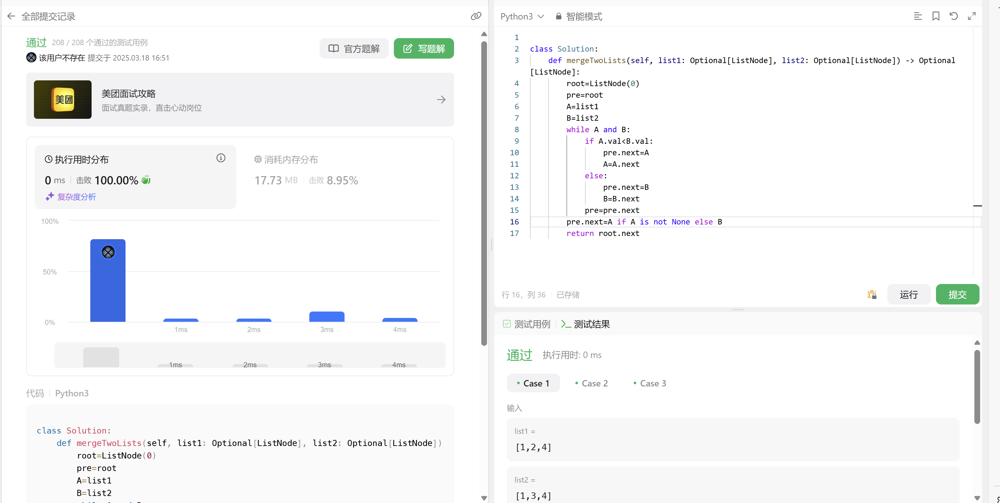
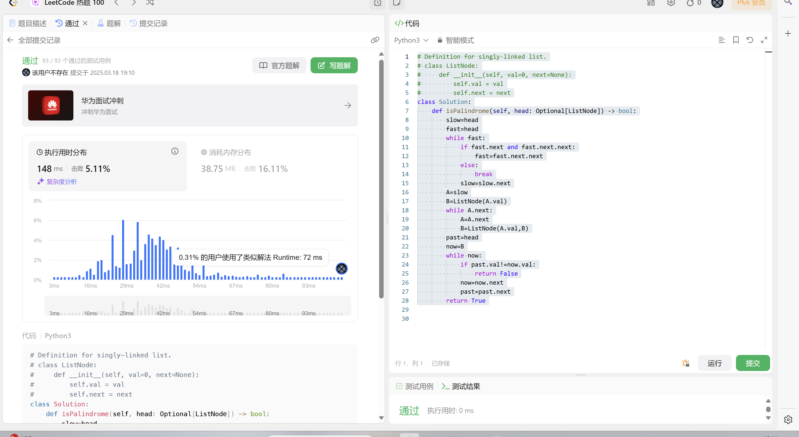
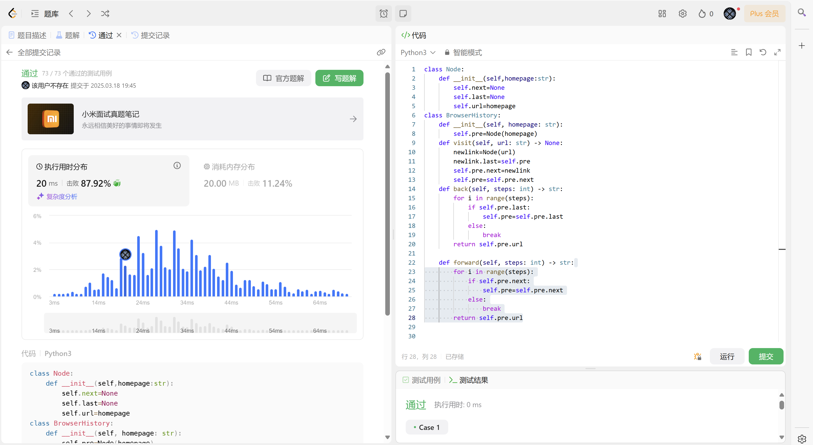
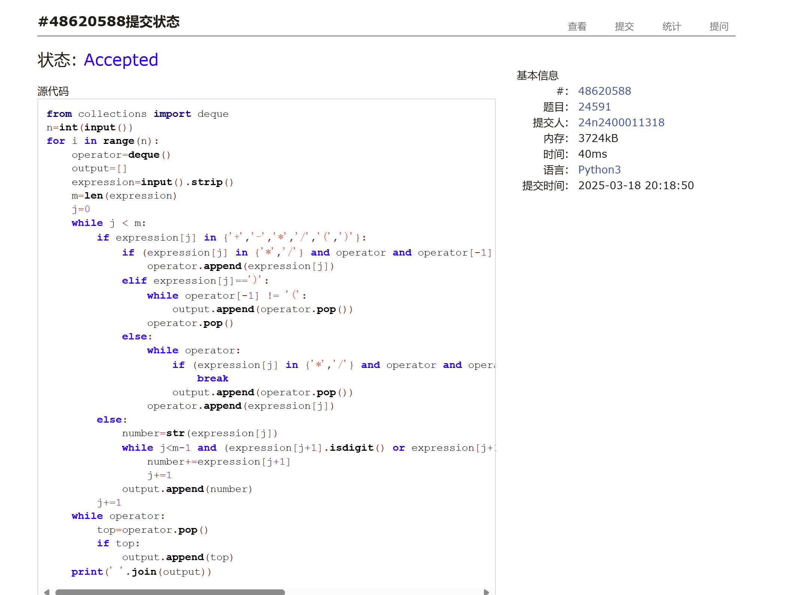
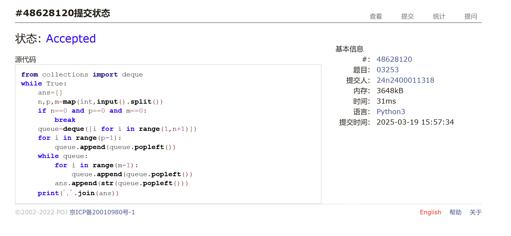
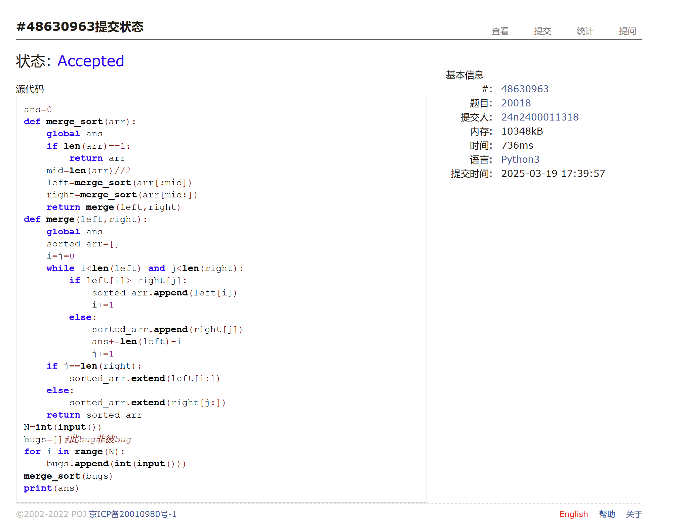

# Assignment #5: 链表、栈、队列和归并排序

Updated 1348 GMT+8 Mar 17, 2025

2025 spring, Complied by 周博文——物理学院


> **说明：**
>
> 1. **解题与记录：**
>
>    对于每一个题目，请提供其解题思路（可选），并附上使用Python或C++编写的源代码（确保已在OpenJudge， Codeforces，LeetCode等平台上获得Accepted）。请将这些信息连同显示“Accepted”的截图一起填写到下方的作业模板中。（推荐使用Typora https://typoraio.cn 进行编辑，当然你也可以选择Word。）无论题目是否已通过，请标明每个题目大致花费的时间。
>
> 2. **提交安排：**提交时，请首先上传PDF格式的文件，并将.md或.doc格式的文件作为附件上传至右侧的“作业评论”区。确保你的Canvas账户有一个清晰可见的头像，提交的文件为PDF格式，并且“作业评论”区包含上传的.md或.doc附件。
>
> 3. **延迟提交：**如果你预计无法在截止日期前提交作业，请提前告知具体原因。这有助于我们了解情况并可能为你提供适当的延期或其他帮助。 
>
> 请按照上述指导认真准备和提交作业，以保证顺利完成课程要求。


## 1. 题目

### LC21.合并两个有序链表

linked list, https://leetcode.cn/problems/merge-two-sorted-lists/

思路：
创建以0为起点的“空”链表，若list1的值小于list2的值，则将list1的值添加到链表，否则将list2的值添加到链表，并将对应链表的项向后移动，并将循环过程中未处理完的项加到链表尾部，最后返回链表（除掉0）。


代码：

```python

class Solution:
    def mergeTwoLists(self, list1: Optional[ListNode], list2: Optional[ListNode]) -> Optional[ListNode]:
        root=ListNode(0)
        pre=root
        A=list1
        B=list2
        while A and B:
            if A.val<B.val:
                pre.next=A
                A=A.next
            else:
                pre.next=B
                B=B.next
            pre=pre.next
        pre.next=A if A is not None else B
        return root.next
```


代码运行截图 <mark>（至少包含有"Accepted"）</mark>




### LC234.回文链表

linked list, https://leetcode.cn/problems/palindrome-linked-list/

<mark>请用快慢指针实现。</mark>

代码：

```python
# Definition for singly-linked list.
# class ListNode:
#     def __init__(self, val=0, next=None):
#         self.val = val
#         self.next = next
class Solution:
    def isPalindrome(self, head: Optional[ListNode]) -> bool:
        slow=head
        fast=head
        while fast:
            if fast.next and fast.next.next:
                fast=fast.next.next
            else:
                break
            slow=slow.next
        A=slow
        B=ListNode(A.val)
        while A.next:
            A=A.next
            B=ListNode(A.val,B)
        past=head
        now=B
        while now:
            if past.val!=now.val:
                return False
            now=now.next
            past=past.next
        return True
```


代码运行截图 <mark>（至少包含有"Accepted"）</mark>




### LC1472.设计浏览器历史记录

doubly-lined list, https://leetcode.cn/problems/design-browser-history/

<mark>请用双链表实现。</mark>


代码：

```python
class Node:
    def __init__(self,homepage:str):
        self.next=None
        self.last=None
        self.url=homepage
class BrowserHistory:
    def __init__(self, homepage: str):
        self.pre=Node(homepage)
    def visit(self, url: str) -> None:
        newlink=Node(url)
        newlink.last=self.pre
        self.pre.next=newlink       
        self.pre=self.pre.next
    def back(self, steps: int) -> str:
        for i in range(steps):
            if self.pre.last:
                self.pre=self.pre.last
            else:
                break
        return self.pre.url

    def forward(self, steps: int) -> str:
        for i in range(steps):
            if self.pre.next:
                self.pre=self.pre.next
            else:
                break
        return self.pre.url
```


代码运行截图 <mark>（至少包含有"Accepted"）</mark>




### 24591: 中序表达式转后序表达式

stack, http://cs101.openjudge.cn/practice/24591/

思路：
抄的课上讲义Shunting Yard算法的思路，感觉很神奇()

代码：

```python
from collections import deque
n=int(input())
for i in range(n):
    operator=deque()
    output=[]
    expression=input().strip()
    m=len(expression)
    j=0
    while j < m:
        if expression[j] in {'+','-','*','/','(',')'}:
            if (expression[j] in {'*','/'} and operator and operator[-1] in {'+','-','('}) or expression[j]=="(":
                operator.append(expression[j])
            elif expression[j]==')':
                while operator[-1] != '(':
                    output.append(operator.pop())
                operator.pop()
            else:
                while operator:
                    if (expression[j] in {'*','/'} and operator and operator[-1] in {'+','-','('}) or(operator and operator[-1]=="("):
                        break
                    output.append(operator.pop())
                operator.append(expression[j])
        else:
            number=str(expression[j])
            while j<m-1 and (expression[j+1].isdigit() or expression[j+1]=='.' ):
                number+=expression[j+1]
                j+=1
            output.append(number)
        j+=1
    while operator:
        top=operator.pop()
        if top:
            output.append(top)
    print(' '.join(output))
```


代码运行截图 <mark>（至少包含有"Accepted"）</mark>




### 03253: 约瑟夫问题No.2

queue, http://cs101.openjudge.cn/practice/03253/

<mark>请用队列实现。</mark>


代码：

```python
from collections import deque
while True:
    ans=[]
    n,p,m=map(int,input().split())
    if n==0 and p==0 and m==0:
        break
    queue=deque([i for i in range(1,n+1)])
    for i in range(p-1):
        queue.append(queue.popleft())
    while queue:
        for i in range(m-1):
            queue.append(queue.popleft())
        ans.append(str(queue.popleft()))
    print(','.join(ans))
```


代码运行截图 <mark>（至少包含有"Accepted"）</mark>




### 20018: 蚂蚁王国的越野跑

merge sort, http://cs101.openjudge.cn/practice/20018/

思路：
记录bug们的速度，利用类似归并排序的思路，将bug们按速度排序，但是是从大到小；每次将后面的bug位次提前时，ans+=len(left)-i(表示超越的虫子的个数)，输出ans即可。


代码：

```python
ans=0
def merge_sort(arr):
    global ans
    if len(arr)==1:
        return arr
    mid=len(arr)//2
    left=merge_sort(arr[:mid])
    right=merge_sort(arr[mid:])
    return merge(left,right)
def merge(left,right):
    global ans
    sorted_arr=[]
    i=j=0
    while i<len(left) and j<len(right):
        if left[i]>=right[j]:
            sorted_arr.append(left[i])
            i+=1
        else:
            sorted_arr.append(right[j])
            ans+=len(left)-i
            j+=1
    if j==len(right):
        sorted_arr.extend(left[i:])
    else:
        sorted_arr.extend(right[j:])
    return sorted_arr
N=int(input())
bugs=[]#此bug非彼bug
for i in range(N):
    bugs.append(int(input()))
merge_sort(bugs)
print(ans)
```


代码运行截图 <mark>（至少包含有"Accepted"）</mark>




## 2. 学习总结和收获

前两周沉迷机器学习，没怎么做每日选做；现在在赶工了，争取这周赶到和最新进度差7天以内💦💦💦（假如同期其他学习任务顺利有时间的话）。
本次作业中，快慢指针那个题一开始没思路，看了官方题解的文字部分才做出来，但感觉写的不太好()；中序表达式抄了讲义的算法思路，感觉自己根本想不出来；双链表和最后的归并排序也暴露我在算法或数据结构的具体实现上有所不足（错语法/结构上缺胳膊少腿等等），得学的更细致一点
