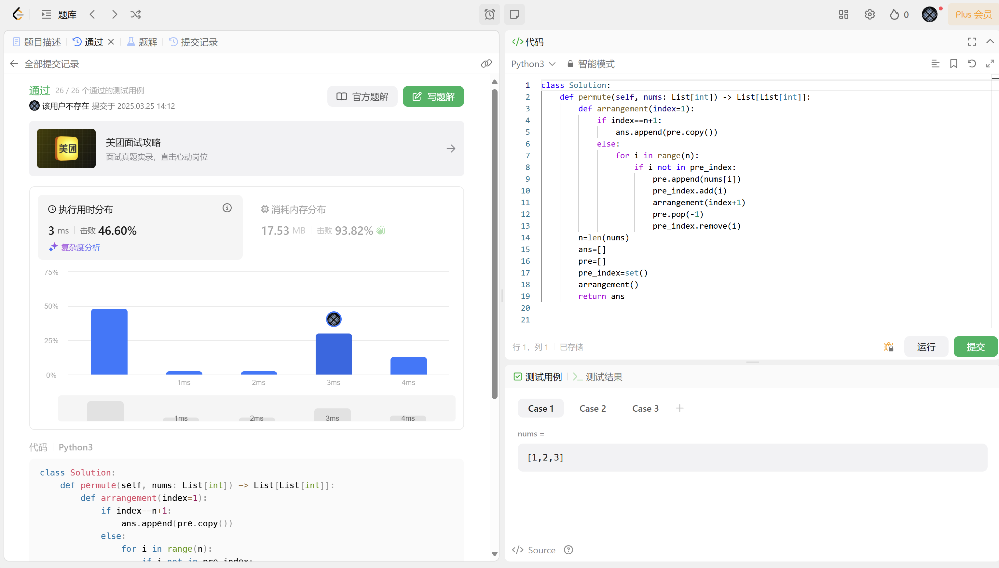
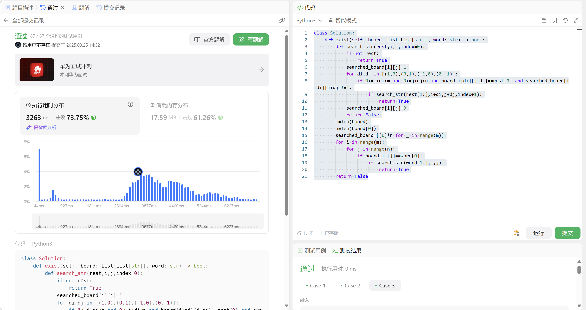
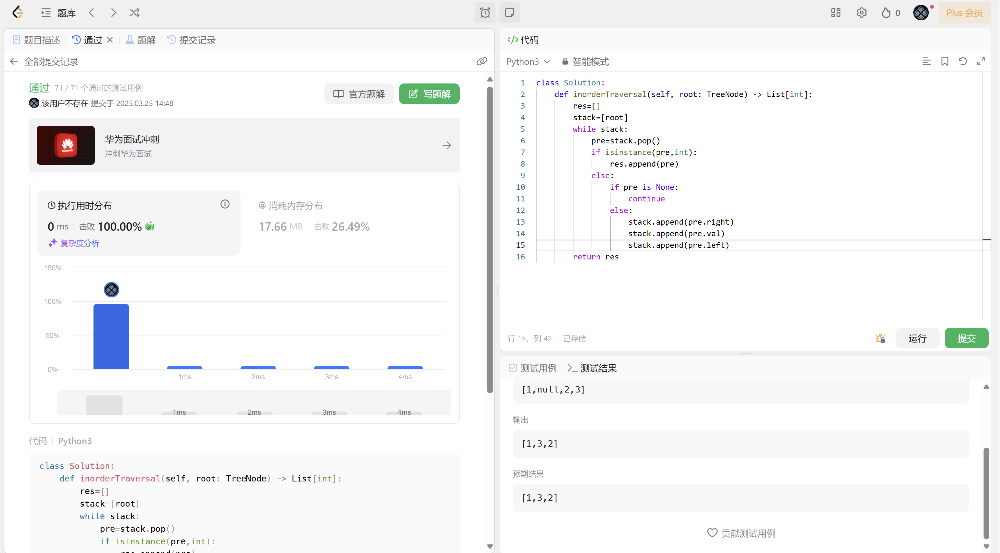
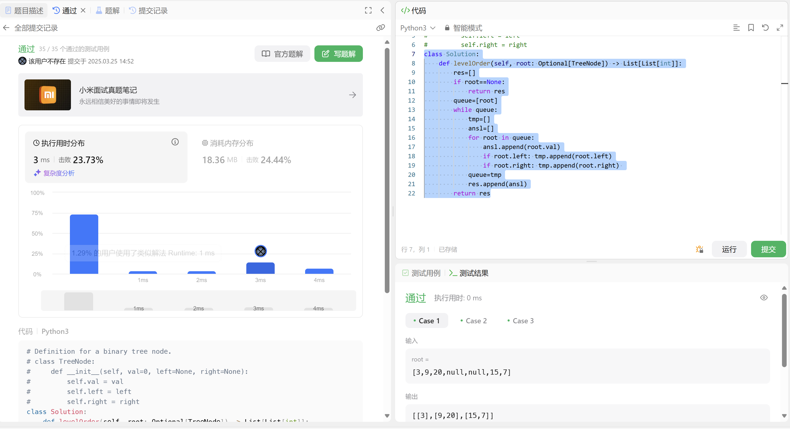
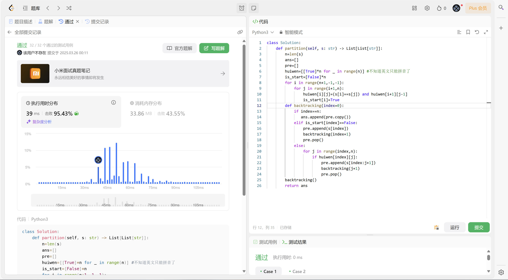
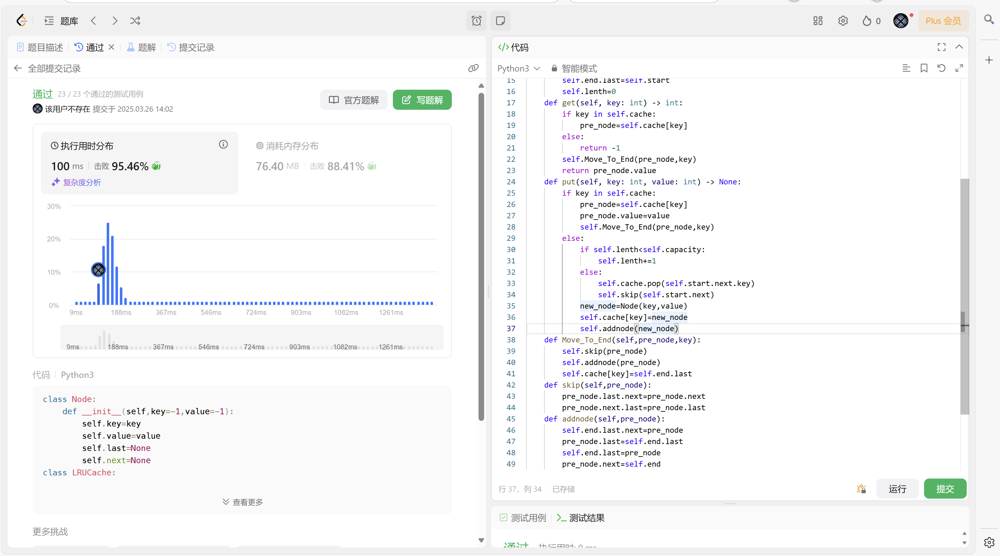

# Assignment #6: 回溯、树、双向链表和哈希表

Updated 1526 GMT+8 Mar 22, 2025

2025 spring, Complied by 周博文——物理学院


> **说明：**
>
> 1. **解题与记录：**
>
>    对于每一个题目，请提供其解题思路（可选），并附上使用Python或C++编写的源代码（确保已在OpenJudge， Codeforces，LeetCode等平台上获得Accepted）。请将这些信息连同显示“Accepted”的截图一起填写到下方的作业模板中。（推荐使用Typora https://typoraio.cn 进行编辑，当然你也可以选择Word。）无论题目是否已通过，请标明每个题目大致花费的时间。
>
> 2. **提交安排：**提交时，请首先上传PDF格式的文件，并将.md或.doc格式的文件作为附件上传至右侧的“作业评论”区。确保你的Canvas账户有一个清晰可见的头像，提交的文件为PDF格式，并且“作业评论”区包含上传的.md或.doc附件。
>
> 3. **延迟提交：**如果你预计无法在截止日期前提交作业，请提前告知具体原因。这有助于我们了解情况并可能为你提供适当的延期或其他帮助。 
>
> 请按照上述指导认真准备和提交作业，以保证顺利完成课程要求。


## 1. 题目

### LC46.全排列

backtracking, https://leetcode.cn/problems/permutations/

思路：
维护列表pre，依次尝试将nums中的元素添加到pre中（若该元素目前不在nums中），添加到n个元素时，将pre添加到ans中；每次添加元素并完成处理后，将元素从nums中移除，并继续尝试添加下一个元素，直到全部尝试完成。

代码：

```python
class Solution:
    def permute(self, nums: List[int]) -> List[List[int]]:
        def arrangement(index=1):
            if index==n+1:
                ans.append(pre.copy())
            else:
                for i in range(n):
                    if i not in pre_index:
                        pre.append(nums[i])
                        pre_index.add(i)
                        arrangement(index+1)
                        pre.pop(-1)
                        pre_index.remove(i)
        n=len(nums)
        ans=[]
        pre=[]
        pre_index=set()
        arrangement()
        return ans

```


代码运行截图 <mark>（至少包含有"Accepted"）</mark>




### LC79: 单词搜索

backtracking, https://leetcode.cn/problems/word-search/

思路：
依次考虑所有可能的下一个元素的位置，如果未搜索且与下一个元素相同，则以该位置为中心搜索下一个元素，同时维护列表searched_board，记录当前路径中已经搜索过的元素，避免重复搜索。


代码：

```python
class Solution:
    def exist(self, board: List[List[str]], word: str) -> bool:
        def search_str(rest,i,j,index=0):
            if not rest:
                return True
            searched_board[i][j]=1
            for di,dj in [(1,0),(0,1),(-1,0),(0,-1)]:
                if 0<=i+di<m and 0<=j+dj<n and board[i+di][j+dj]==rest[0] and searched_board[i+di][j+dj]!=1:
                    if search_str(rest[1:],i+di,j+dj,index+1):
                        return True
            searched_board[i][j]=0
            return False
        m=len(board)
        n=len(board[0])
        searched_board=[[0]*n for _ in range(m)]
        for i in range(m):
            for j in range(n):
                if board[i][j]==word[0]:
                    if search_str(word[1:],i,j):
                        return True
        return False
```


代码运行截图 <mark>（至少包含有"Accepted"）</mark>



### LC94.二叉树的中序遍历

dfs, https://leetcode.cn/problems/binary-tree-inorder-traversal/

思路：
用栈，将该节点的右侧、值、左侧依次入栈，取出元素后若为非空节点执行上述操作，若为数值则将数值加入待输出数组中，直到栈为空。

代码：

```python
class Solution:
    def inorderTraversal(self, root: TreeNode) -> List[int]:
        res=[]
        stack=[root]
        while stack:
            pre=stack.pop()
            if isinstance(pre,int):
                res.append(pre)
            else:
                if pre is None:
                    continue
                else:
                    stack.append(pre.right)
                    stack.append(pre.val)
                    stack.append(pre.left)
        return res
```


代码运行截图 <mark>（至少包含有"Accepted"）</mark>



### LC102.二叉树的层序遍历

bfs, https://leetcode.cn/problems/binary-tree-level-order-traversal/

思路：
bfs，用队列，while循环一次考虑一层，将每层节点依次入队，出队时将节点的值加入待输出子数组中，并将节点的左右子节点入新队，将队列指向新队列，将子数组加入待输出数组，直到队列为空。


代码：

```python
class Solution:
    def levelOrder(self, root: Optional[TreeNode]) -> List[List[int]]:
        res=[]
        if root==None:
            return res
        queue=[root]
        while queue:
            tmp=[]
            ansl=[]
            for root in queue:
                ansl.append(root.val)
                if root.left: tmp.append(root.left)
                if root.right: tmp.append(root.right) 
            queue=tmp
            res.append(ansl)
        return res
```


代码运行截图 <mark>（至少包含有"Accepted"）</mark>



### LC131.分割回文串

dp, backtracking, https://leetcode.cn/problems/palindrome-partitioning/

思路：
首先用数组记录[i,j]是否为回文串，同时记录i是否为长度大于1的回文串的开头（用is_start记录），同时用pre记录当前路径，用ans记录所有路径，依次尝试将[i,j]加入pre中（若i不为更长回文串开头，则只加入i以剪枝），搜索完后删除当前搜索的切片，继续搜索，直到完成。

代码：

```python
class Solution:
    def partition(self, s: str) -> List[List[str]]:
        n=len(s)
        ans=[]
        pre=[]
        huiwen=[[True]*n for _ in range(n)] #不知道英文只能拼音了
        is_start=[False]*n
        for i in range(n+1,-1,-1):
            for j in range(i+1,n):
                huiwen[i][j]=(s[i]==s[j]) and huiwen[i+1][j-1]
                is_start[i]=True
        def backtracking(index=0):
            if index==n:
               ans.append(pre.copy())
            elif is_start[index]==False:
                pre.append(s[index])
                backtracking(index+1)
                pre.pop()
            else:
                for j in range(index,n):
                    if huiwen[index][j]:
                        pre.append(s[index:j+1])
                        backtracking(j+1)
                        pre.pop()
        backtracking()
        return ans
```


代码运行截图 <mark>（至少包含有"Accepted"）</mark>



### LC146.LRU缓存

hash table, doubly-linked list, https://leetcode.cn/problems/lru-cache/

思路：
一开始没看到hash table写的很暴力，成功写出70行/5500ms的史山；后使用hash表存储key->node，用双向链表存储按顺序存储缓存内容，并将重复操作打包成函数，大幅优化可读性和效率。


代码：

```python
class Node:
    def __init__(self,key=-1,value=-1):
        self.key=key
        self.value=value
        self.last=None
        self.next=None
class LRUCache:

    def __init__(self, capacity: int):
        self.capacity=capacity
        self.cache={}
        self.start=Node()
        self.end=Node()
        self.start.next=self.end
        self.end.last=self.start
        self.lenth=0
    def get(self, key: int) -> int:
        if key in self.cache:
            pre_node=self.cache[key]
        else:
            return -1
        self.Move_To_End(pre_node,key)
        return pre_node.value
    def put(self, key: int, value: int) -> None:
        if key in self.cache:
            pre_node=self.cache[key]
            pre_node.value=value
            self.Move_To_End(pre_node,key)
        else:
            if self.lenth<self.capacity:
                self.lenth+=1
            else:
                self.cache.pop(self.start.next.key)
                self.skip(self.start.next)
            new_node=Node(key,value)
            self.cache[key]=new_node
            self.addnode(new_node)
    def Move_To_End(self,pre_node,key):
        self.skip(pre_node)
        self.addnode(pre_node)
        self.cache[key]=self.end.last
    def skip(self,pre_node):
        pre_node.last.next=pre_node.next
        pre_node.next.last=pre_node.last
    def addnode(self,pre_node):
        self.end.last.next=pre_node
        pre_node.last=self.end.last
        self.end.last=pre_node
        pre_node.next=self.end
```


代码运行截图 <mark>（至少包含有"Accepted"）</mark>




## 2. 学习总结和收获

作业似乎总体不难？算是在寒假过后重新熟悉了树等一些知识点，只有分割回文串一开始dp那一步卡住了看了题解思路，然后最后一题代码比较长调通用了点时间。每日选做之前有事欠了三个多星期的量，最近逐渐补了一点进度（发现做过的题目还是蛮多的），着重看了几个tough的题，但tough的题大多数还是很难做出来（部分时候直接无从下手），需要多加练习


