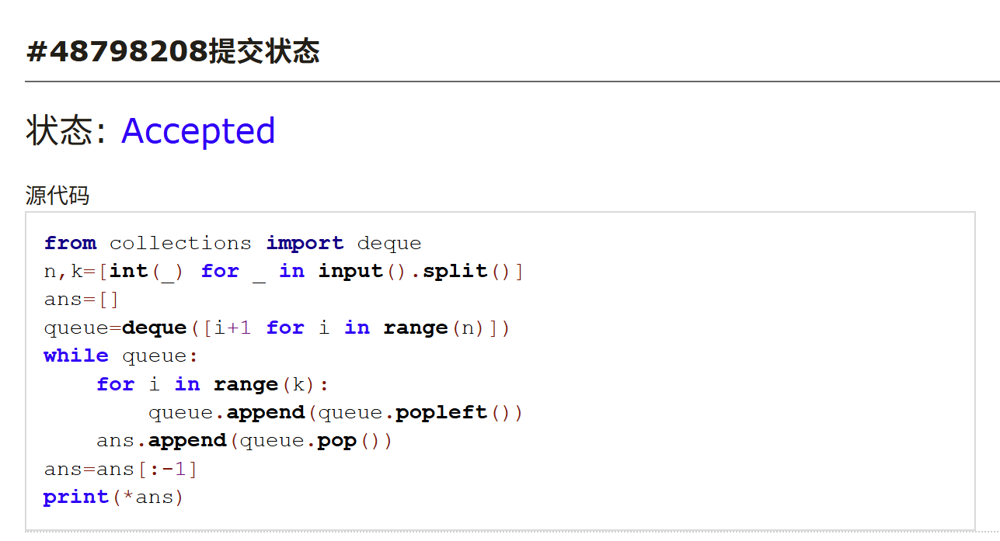
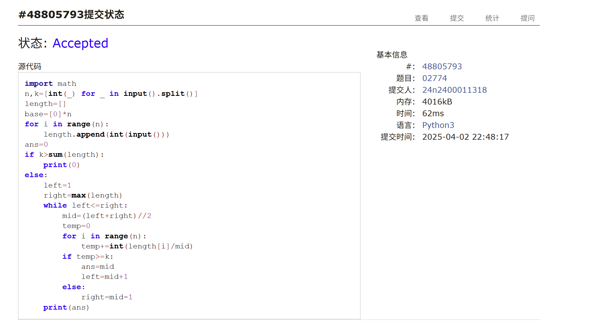
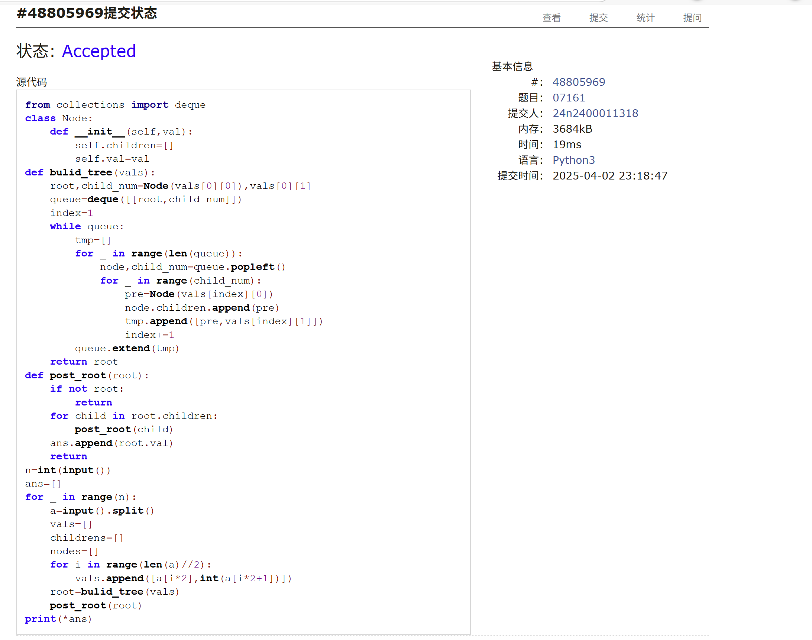
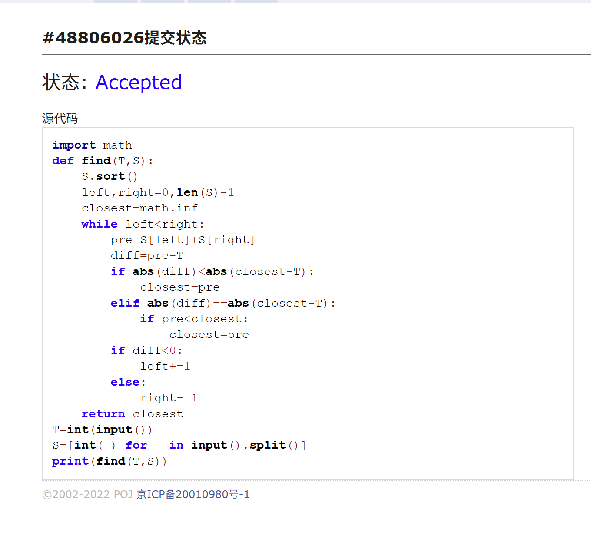
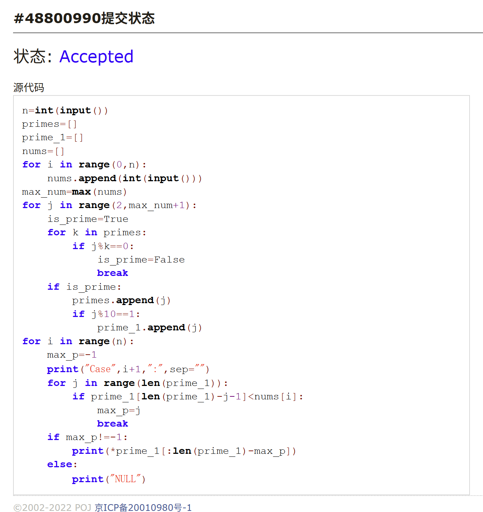
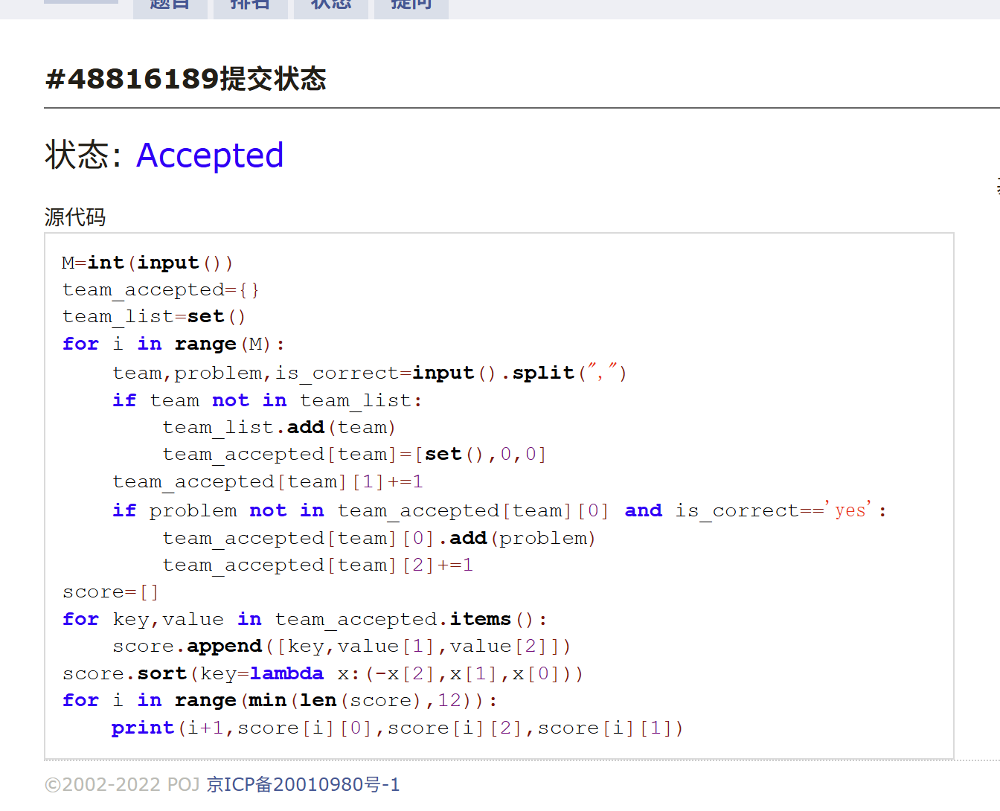

# Assignment #7: 20250402 Mock Exam

Updated 1624 GMT+8 Apr 2, 2025

2025 spring, Complied by <mark>同学的姓名、院系</mark>


> **说明：**
>
> 1. **⽉考**：AC2。考试题⽬都在“题库（包括计概、数算题目）”⾥⾯，按照数字题号能找到，可以重新提交。作业中提交⾃⼰最满意版本的代码和截图。
>
> 2. **解题与记录：**
>
>    对于每一个题目，请提供其解题思路（可选），并附上使用Python或C++编写的源代码（确保已在OpenJudge， Codeforces，LeetCode等平台上获得Accepted）。请将这些信息连同显示“Accepted”的截图一起填写到下方的作业模板中。（推荐使用Typora https://typoraio.cn 进行编辑，当然你也可以选择Word。）无论题目是否已通过，请标明每个题目大致花费的时间。
>
> 3. **提交安排：**提交时，请首先上传PDF格式的文件，并将.md或.doc格式的文件作为附件上传至右侧的“作业评论”区。确保你的Canvas账户有一个清晰可见的头像，提交的文件为PDF格式，并且“作业评论”区包含上传的.md或.doc附件。
>
> 4. **延迟提交：**如果你预计无法在截止日期前提交作业，请提前告知具体原因。这有助于我们了解情况并可能为你提供适当的延期或其他帮助。 
>
> 请按照上述指导认真准备和提交作业，以保证顺利完成课程要求。


## 1. 题目

### E05344:最后的最后

http://cs101.openjudge.cn/practice/05344/


思路：
直接做的


代码：

```python
n,k=[int(_) for _ in input().split()]
def dfs(slices,index=0,i=k):
    if index==len(length)-1:
        return length[-1]//slices
    max_length=0
    for i in range(base[index],min(slices-(len(length)-index)+2,i+1)):
        pre_length=length[index]//i
        if pre_length<max_length:
            break
        max_length=max(max_length,min(pre_length,dfs(slices-i,index+1,i)))
    return max_length
length=[]
base=[0]*n
for i in range(n):
    length.append(int(input()))
length.sort()
length.reverse()
sumup=sum(length)
for i in range(n):
    base[i]=max(int(length[i]/sumup*k-1),1)
ans=dfs(k)
print(ans)
```


代码运行截图 <mark>（至少包含有"Accepted"）</mark>




### M02774: 木材加工

binary search, http://cs101.openjudge.cn/practice/02774/


思路：
md二分查找意识不够，一开始强行搜索然后TLE，疯狂剪枝然后失败；二分查找确实简单（但还有地方不太理解，为啥right=min(length)而不是max会报错？）


代码：

```python
import math
n,k=[int(_) for _ in input().split()]
length=[]
base=[0]*n
for i in range(n):
    length.append(int(input()))
ans=0
if k>sum(length):
    print(0)
else:
    left=1
    right=max(length)
    while left<=right:
        mid=(left+right)//2
        temp=0
        for i in range(n):
            temp+=int(length[i]/mid)
        if temp>=k:
            ans=mid
            left=mid+1
        else:
            right=mid-1
    print(ans)
```


代码运行截图 <mark>（至少包含有"Accepted"）</mark>




### M07161:森林的带度数层次序列存储

tree, http://cs101.openjudge.cn/practice/07161/


思路：
错因是，不知道后根遍历是什么，以及不熟悉建树（一直做leetcode导致的），补习了一下就好了


代码：

```python
from collections import deque
class Node:
    def __init__(self,val):
        self.children=[]
        self.val=val
def bulid_tree(vals):
    root,child_num=Node(vals[0][0]),vals[0][1]
    queue=deque([[root,child_num]])
    index=1
    while queue:
        tmp=[]
        for _ in range(len(queue)):
            node,child_num=queue.popleft()
            for _ in range(child_num):
                pre=Node(vals[index][0])
                node.children.append(pre)
                tmp.append([pre,vals[index][1]])
                index+=1
        queue.extend(tmp)
    return root
def post_root(root):
    if not root:
        return
    for child in root.children:
        post_root(child)
    ans.append(root.val)
    return 
n=int(input())
ans=[]
for _ in range(n):
    a=input().split()
    vals=[]
    childrens=[]
    nodes=[]
    for i in range(len(a)//2):
        vals.append([a[i*2],int(a[i*2+1])])
    root=bulid_tree(vals)
    post_root(root)
print(*ans)
```


代码运行截图 <mark>（至少包含有"Accepted"）</mark>



### M18156:寻找离目标数最近的两数之和

two pointers, http://cs101.openjudge.cn/practice/18156/


思路：
双指针，根据题目条件决定是否要更新最小值，并根据差值正负性决定要移动左还是右指针，直到俩指针相遇。

代码：

```python
import math
def find(T,S):
    S.sort()
    left,right=0,len(S)-1
    closest=math.inf
    while left<right:
        pre=S[left]+S[right]
        diff=pre-T
        if abs(diff)<abs(closest-T):
            closest=pre
        elif abs(diff)==abs(closest-T):
            if pre<closest:
                closest=pre
        if diff<0:
            left+=1
        else:
            right-=1
    return closest
T=int(input())
S=[int(_) for _ in input().split()]
print(find(T,S))
```


代码运行截图 <mark>（至少包含有"Accepted"）</mark>




### M18159:个位为 1 的质数个数

sieve, http://cs101.openjudge.cn/practice/18159/


思路：

在几个待求范围中最大的范围上筛法筛质数，然后统计个位为1的质数个数，然后根据各范围截断输出。

代码：

```python
n=int(input())
primes=[]
prime_1=[]
nums=[]
for i in range(0,n):
    nums.append(int(input()))
max_num=max(nums)
for j in range(2,max_num+1):
    is_prime=True
    for k in primes:
        if j%k==0:
            is_prime=False
            break
    if is_prime:
        primes.append(j)
        if j%10==1:
            prime_1.append(j)
for i in range(n):
    max_p=-1
    print("Case",i+1,":",sep="")
    for j in range(len(prime_1)):
        if prime_1[len(prime_1)-j-1]<nums[i]:
            max_p=j
            break
    if max_p!=-1:
        print(*prime_1[:len(prime_1)-max_p])
    else:
        print("NULL")
```


代码运行截图 <mark>（至少包含有"Accepted"）</mark>




### M28127:北大夺冠

hash table, http://cs101.openjudge.cn/practice/28127/


思路：
直接用字典记录就行了，然后按照题目要求排序输出。好...好简单啊，为啥考场上没做......

代码：

```python
M=int(input())
team_accepted={}
team_list=set()
for i in range(M):
    team,problem,is_correct=input().split(",")
    if team not in team_list:
        team_list.add(team)
        team_accepted[team]=[set(),0,0]
    team_accepted[team][1]+=1
    if problem not in team_accepted[team][0] and is_correct=='yes':
        team_accepted[team][0].add(problem)
        team_accepted[team][2]+=1
score=[]
for key,value in team_accepted.items():
    score.append([key,value[1],value[2]])
score.sort(key=lambda x:(-x[2],x[1],x[0]))
for i in range(min(len(score),12)):
    print(i+1,score[i][0],score[i][2],score[i][1])
```


代码运行截图 ==（AC代码截图，至少包含有"Accepted"）==



## 2. 学习总结和收获

这次大多数题目都会做，但是做的不好，原因是1、对二分查找遗忘没有用的意识；2、对树的遍历概念不熟悉；3、实现不够简明，喜欢微操，导致细节处理过于繁琐思路乱掉，方向是对的但调不出来；部分问题在平时练习因为给自己的时间限制很宽松并没有暴露出来，之前没有做过周赛导致的，以后要练练。但下周其他科目期中考试接踵而至，可能额外练习只能缓一缓了


