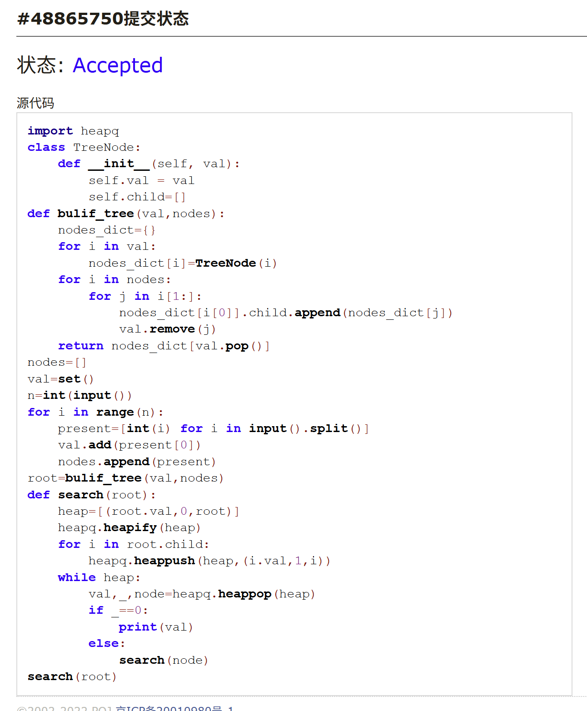
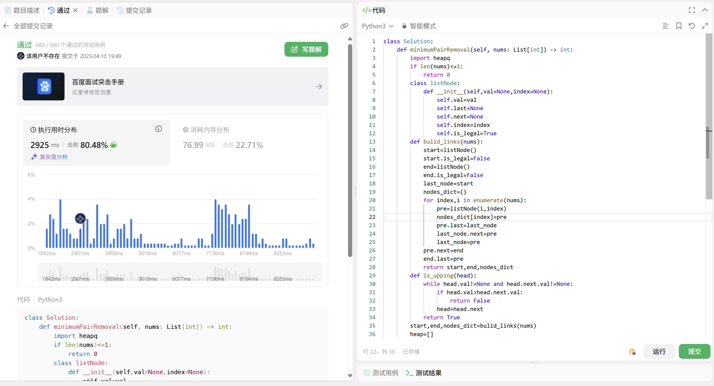

# Assignment #8: 树为主

Updated 1704 GMT+8 Apr 8, 2025

2025 spring, Complied by 周博文——物理学院


> **说明：**
>
> 1. **解题与记录：**
>
>    对于每一个题目，请提供其解题思路（可选），并附上使用Python或C++编写的源代码（确保已在OpenJudge， Codeforces，LeetCode等平台上获得Accepted）。请将这些信息连同显示“Accepted”的截图一起填写到下方的作业模板中。（推荐使用Typora https://typoraio.cn 进行编辑，当然你也可以选择Word。）无论题目是否已通过，请标明每个题目大致花费的时间。
>
> 2. **提交安排：**提交时，请首先上传PDF格式的文件，并将.md或.doc格式的文件作为附件上传至右侧的“作业评论”区。确保你的Canvas账户有一个清晰可见的头像，提交的文件为PDF格式，并且“作业评论”区包含上传的.md或.doc附件。
>
> 3. **延迟提交：**如果你预计无法在截止日期前提交作业，请提前告知具体原因。这有助于我们了解情况并可能为你提供适当的延期或其他帮助。 
>
> 请按照上述指导认真准备和提交作业，以保证顺利完成课程要求。


## 1. 题目

### LC108.将有序数组转换为二叉树

dfs, https://leetcode.cn/problems/convert-sorted-array-to-binary-search-tree/

思路：
为了让二叉树平衡，我们应保证每个节点左右两侧数目相近，因此选择数列的中点作为根节点，然后递归地构造左右子树。

代码：

```python
class Solution:
    def sortedArrayToBST(self, nums: List[int]) -> Optional[TreeNode]:
        n=len(nums)
        if n==0:
            return None
        mid=int(n/2)
        root=TreeNode()
        root.val=nums[mid]
        root.left=self.sortedArrayToBST(nums[:mid])
        root.right=self.sortedArrayToBST(nums[mid+1:])
        return root
```


代码运行截图 <mark>（至少包含有"Accepted"）</mark>


### M27928:遍历树

 adjacency list, dfs, http://cs101.openjudge.cn/practice/27928/

思路：
先建树，找出没有作为过子节点的节点为根节点输出，然后遍历树，对于每个节点及其子节点，按照值从小到大，若为子节点则遍历子节点，若为根节点则输出


代码：

```python
import heapq
class TreeNode:
    def __init__(self, val):
        self.val = val
        self.child=[]
def bulif_tree(val,nodes):
    nodes_dict={}
    for i in val:
        nodes_dict[i]=TreeNode(i)
    for i in nodes:
        for j in i[1:]:
            nodes_dict[i[0]].child.append(nodes_dict[j])
            val.remove(j)
    return nodes_dict[val.pop()]
nodes=[]
val=set()
n=int(input())
for i in range(n):
    present=[int(i) for i in input().split()]
    val.add(present[0])
    nodes.append(present)
root=bulif_tree(val,nodes)
def search(root):
    heap=[(root.val,0,root)]
    heapq.heapify(heap)
    for i in root.child:
        heapq.heappush(heap,(i.val,1,i))
    while heap:
        val,_,node=heapq.heappop(heap)
        if _==0:
            print(val)
        else:
            search(node)
search(root)
```


代码运行截图 <mark>（至少包含有"Accepted"）</mark>



### LC129.求根节点到叶节点数字之和

dfs, https://leetcode.cn/problems/sum-root-to-leaf-numbers/

思路：
dfs，很简单


代码：

```python
class Solution:
    def sumNumbers(self, root: Optional[TreeNode]) -> int:
        def dfs(node,val):
            if node==None:
                return 0
            if not node.left and not node.right:
                return val*10+node.val
            else:
                return dfs(node.left,val*10+node.val)+dfs(node.right,val*10+node.val)
        return dfs(root,0)
```


代码运行截图 <mark>（至少包含有"Accepted"）</mark>


### M22158:根据二叉树前中序序列建树

tree, http://cs101.openjudge.cn/practice/22158/

思路：
建树一开始不会去问了kimi，思路是，前序遍历的第一个节点是根节点，在中序遍历中找到这个节点，其左侧为左子树，右侧为右子树，然后取切片递归地建树，然后后续遍历。
bug处理：一开始写的程序输出有莫名其妙的换行，原因是stdin的readlines()函数会读取换行符，因此需要strip()函数去掉换行符。

代码：

```python
import sys
class Treenode():
    def __init__(self, val):
        self.val = val
        self.left = None
        self.right = None
def buildtree(preorder,inorder):
    if len(preorder)==0:
        return None
    root_val=preorder[0]
    root=Treenode(root_val)
    root_index=inorder.index(root_val)
    root.left=buildtree(preorder[1:root_index+1],inorder[:root_index])
    root.right=buildtree(preorder[root_index+1:],inorder[root_index+1:])
    return root
def postorder(root,is_root=0):
    if root==None:
        return 
    postorder(root.left)
    postorder(root.right)
    print(root.val,end='') if is_root==0 else print(root.val)
batch=[]
strings=sys.stdin.readlines()
for line in strings:
    batch.append(line.strip())
    if len(batch)==2:
        root=buildtree(batch[0],batch[1])
        postorder(root,1)
        batch=[]
```


代码运行截图 <mark>（至少包含有"Accepted"）</mark>


### M24729:括号嵌套树

dfs, stack, http://cs101.openjudge.cn/practice/24729/

思路：
利用counter记录前括号-后括号的数目，当counter为0时，若此时在处理后括号，则找到了完整的子树；否则判断是否找到的是叶节点（利用是否后继前括号），若是则建立子树并加入child，否则继续搜索。


代码：

```python
class TreeNode:
    def __init__(self, val):
        self.val = val
        self.child=[]
def buildTree(string):
    if string==None or string[0].isalpha()==False:
        return  
    root=TreeNode(string[0])
    rest=string[2:-1]
    child_string=""
    counter=0
    if rest:
        for index,i in enumerate(rest):
            if i==",":
                continue
            child_string+=i
            if i=="(":
                counter+=1
            elif i==")":
                counter-=1
                if counter==0:
                    root.child.append(buildTree(child_string))
                    child_string=""
            if counter==0 and child_string and (index==len(rest)-1 or rest[index+1]!="("):
                root.child.append(buildTree(child_string))
                child_string=""
    return root
def preorder(root):
    if root:
        print(root.val,end="")
        for i in root.child:
            preorder(i)
def postorder(root):
    if root:
        for i in root.child:
            postorder(i)
        print(root.val,end="")
string=input()
root=buildTree(string)
preorder(root)
print()
postorder(root)
```


代码运行截图 <mark>（至少包含有"Accepted"）</mark>


### LC3510.移除最小数对使数组有序II

doubly-linked list + heap, https://leetcode.cn/problems/minimum-pair-removal-to-sort-array-ii/

思路：
看了tag才出的思路。。。用堆记录现有数对的最小值和下标，用双向链表记录现存的数字，每次取出堆顶，若不合法则跳过，若合法且判断当前未达成目标则删除链表中的数字，并更新，再将受到影响的新和加入堆，并记录操作次数，若达到目标则输出操作次数

又：这道题代码好长，调了好久(对细节的把控还是不行)

代码：

```python
class Solution:
    def minimumPairRemoval(self, nums: List[int]) -> int:
        import heapq
        if len(nums)<=1:
            return 0
        class listNode:
            def __init__(self,val=None,index=None):
                self.val=val
                self.last=None
                self.next=None
                self.index=index
                self.is_legal=True
        def bulid_links(nums):
            start=listNode()
            start.is_legal=False
            end=listNode()
            end.is_legal=False
            last_node=start
            nodes_dict={}
            for index,i in enumerate(nums):
                pre=listNode(i,index)
                nodes_dict[index]=pre
                pre.last=last_node
                last_node.next=pre
                last_node=pre
            pre.next=end
            end.last=pre
            return start,end,nodes_dict
        def is_upping(head):
            while head.val!=None and head.next.val!=None:
                if head.val>head.next.val:
                    return False
                head=head.next
            return True
        start,end,nodes_dict=bulid_links(nums)
        heap=[]
        ans=0
        for i in range(len(nums)-1):
            heapq.heappush(heap,(nums[i]+nums[i+1],i))
        while True:
            if not heap:
                return ans
            added,index=heapq.heappop(heap)
            if nodes_dict[index].is_legal==False or nodes_dict[index].next.is_legal==False or added!=nodes_dict[index].val+nodes_dict[index].next.val:
                continue
            elif index==0 and is_upping(start.next):
                return ans
            else:
                ans+=1
                nodes_dict[index].val+=nodes_dict[index].next.val
                nodes_dict[index].next.is_legal=False
                nxtnxtnode=nodes_dict[index].next.next
                nxtnxtnode.last=nodes_dict[index]
                nodes_dict[index].next=nxtnxtnode
                if nodes_dict[index].next.val!=None:
                    heapq.heappush(heap,(nodes_dict[index].val+nodes_dict[index].next.val,index))
                if nodes_dict[index].last.val!=None:
                    heapq.heappush(heap,(nodes_dict[index].val+nodes_dict[index].last.val,nodes_dict[index].last.index))

```


代码运行截图 <mark>（至少包含有"Accepted"）</mark>




## 2. 学习总结和收获

发现自己debug能力，尤其是在代码相对复杂时的debug能力还是太烂了，很难想象若是在oj环境不给出出错的样例要多久才能把最后一题调对。。。
这周还在搞期中考试（周日高数最后一门考完），每日选做下周一定（）


