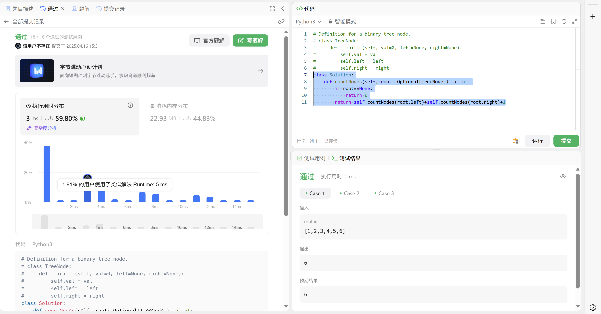
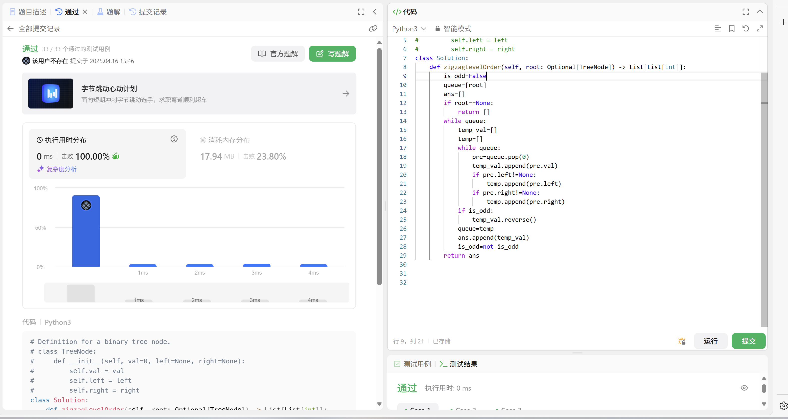
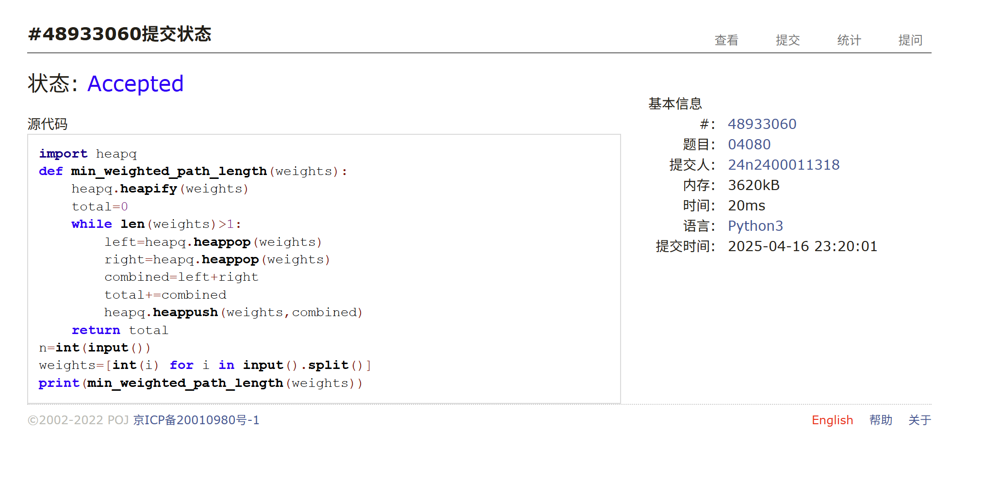
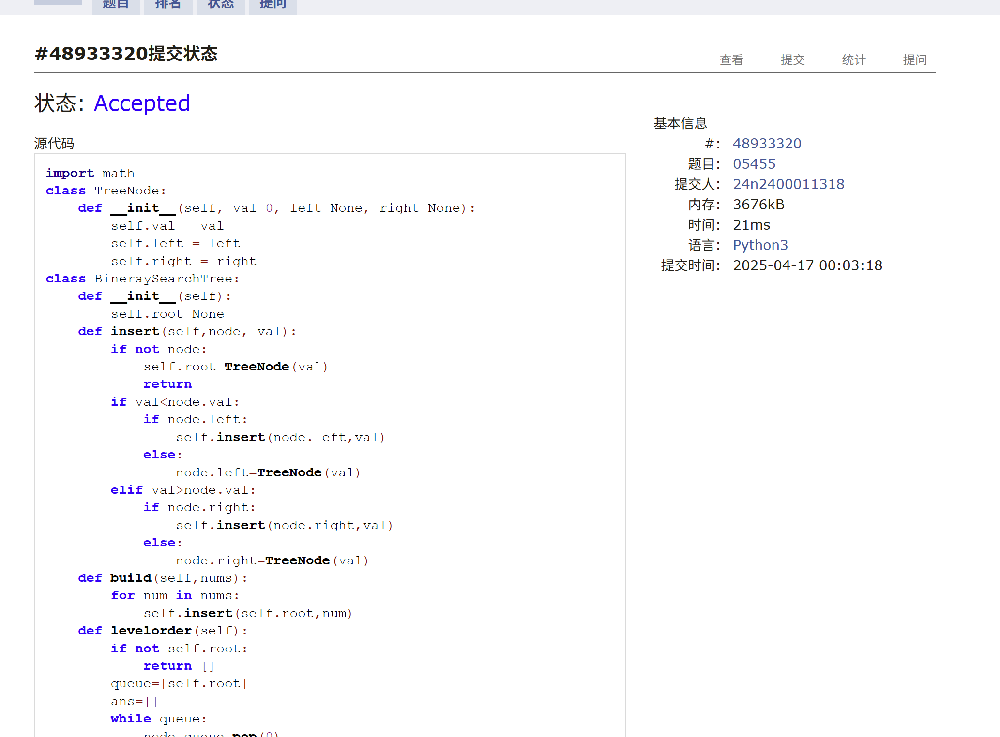
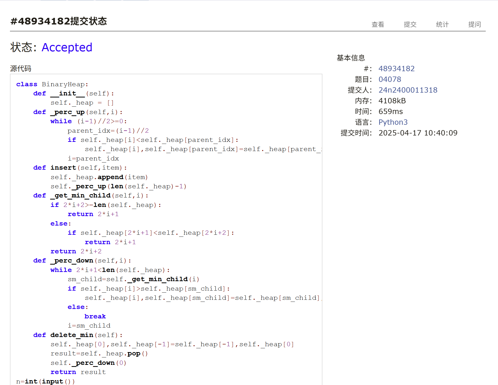
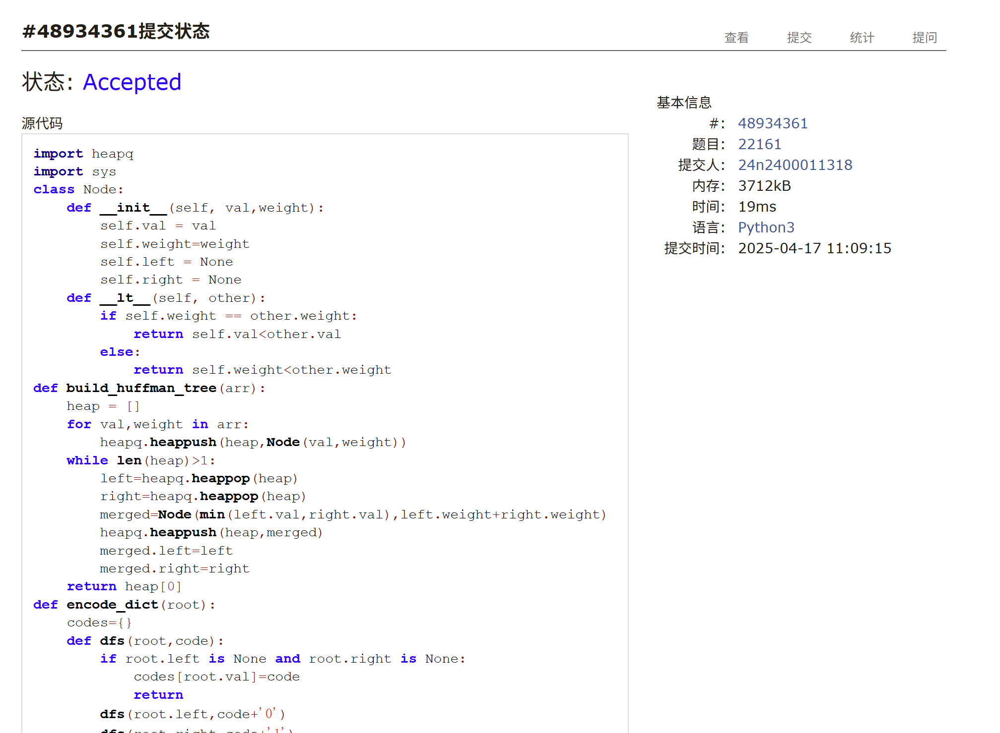

# Assignment #9: Huffman, BST & Heap

Updated 1834 GMT+8 Apr 15, 2025

2025 spring, Complied by 周博文——物理学院


> **说明：**
>
> 1. **解题与记录：**
>
>    对于每一个题目，请提供其解题思路（可选），并附上使用Python或C++编写的源代码（确保已在OpenJudge， Codeforces，LeetCode等平台上获得Accepted）。请将这些信息连同显示“Accepted”的截图一起填写到下方的作业模板中。（推荐使用Typora https://typoraio.cn 进行编辑，当然你也可以选择Word。）无论题目是否已通过，请标明每个题目大致花费的时间。
>
> 2. **提交安排：**提交时，请首先上传PDF格式的文件，并将.md或.doc格式的文件作为附件上传至右侧的“作业评论”区。确保你的Canvas账户有一个清晰可见的头像，提交的文件为PDF格式，并且“作业评论”区包含上传的.md或.doc附件。
>
> 3. **延迟提交：**如果你预计无法在截止日期前提交作业，请提前告知具体原因。这有助于我们了解情况并可能为你提供适当的延期或其他帮助。 
>
> 请按照上述指导认真准备和提交作业，以保证顺利完成课程要求。


## 1. 题目

### LC222.完全二叉树的节点个数

dfs, https://leetcode.cn/problems/count-complete-tree-nodes/

思路：
递归


代码：

```python
class Solution:
    def countNodes(self, root: Optional[TreeNode]) -> int:
        if root==None:
            return 0
        return self.countNodes(root.left)+self.countNodes(root.right)+1
```


代码运行截图 <mark>（至少包含有"Accepted"）</mark>



### LC103.二叉树的锯齿形层序遍历

bfs, https://leetcode.cn/problems/binary-tree-zigzag-level-order-traversal/

思路：
层序遍历，记录奇偶，奇数层倒序记录入ans


代码：

```python
class Solution:
    def zigzagLevelOrder(self, root: Optional[TreeNode]) -> List[List[int]]:
        is_odd=False
        queue=[root]
        ans=[]
        if root==None:
            return []
        while queue:
            temp_val=[]
            temp=[]
            while queue:
                pre=queue.pop(0)
                temp_val.append(pre.val)
                if pre.left!=None:
                    temp.append(pre.left)
                if pre.right!=None:
                    temp.append(pre.right)
            if is_odd:
                temp_val.reverse()
            queue=temp
            ans.append(temp_val)
            is_odd=not is_odd
        return ans

```


代码运行截图 <mark>（至少包含有"Accepted"）</mark>




### M04080:Huffman编码树

greedy, http://cs101.openjudge.cn/practice/04080/

思路：

讲义思路

代码：

```python
import heapq
def min_weighted_path_length(weights):
    heapq.heapify(weights)
    total=0
    while len(weights)>1:
        left=heapq.heappop(weights)
        right=heapq.heappop(weights)
        combined=left+right
        total+=combined
        heapq.heappush(weights,combined)
    return total
n=int(input())
weights=[int(i) for i in input().split()]
print(min_weighted_path_length(weights))
```


代码运行截图 <mark>（至少包含有"Accepted"）</mark>




### M05455: 二叉搜索树的层次遍历

http://cs101.openjudge.cn/practice/05455/

思路：

直接建二叉搜索树，然后层次遍历输出

代码：

```python
import math
class TreeNode:
    def __init__(self, val=0, left=None, right=None):
        self.val = val
        self.left = left
        self.right = right
class BineraySearchTree:
    def __init__(self):
        self.root=None
    def insert(self,node, val):
        if not node:
            self.root=TreeNode(val)
            return
        if val<node.val:
            if node.left:
                self.insert(node.left,val)
            else:
                node.left=TreeNode(val)
        elif val>node.val:
            if node.right:
                self.insert(node.right,val)
            else:
                node.right=TreeNode(val)
    def build(self,nums):
        for num in nums:
            self.insert(self.root,num)
    def levelorder(self):
        if not self.root:
            return []
        queue=[self.root]
        ans=[]
        while queue:
            node=queue.pop(0)
            ans.append(node.val)
            if node.left:
                queue.append(node.left)
            if node.right:
                queue.append(node.right)
        return ans
nums=[int(i) for i in input().split()]
Tree=BineraySearchTree()
Tree.build(nums)
root=Tree.root
print(*Tree.levelorder())
```


代码运行截图 <mark>（至少包含有"Accepted"）</mark>





### M04078: 实现堆结构

手搓实现，http://cs101.openjudge.cn/practice/04078/

类似的题目是 晴问9.7: 向下调整构建大顶堆，https://sunnywhy.com/sfbj/9/7

思路：

讲义思路，建堆

代码：

```python
class BinaryHeap:
    def __init__(self):
        self._heap = []
    def _perc_up(self,i):
        while (i-1)//2>=0:
            parent_idx=(i-1)//2
            if self._heap[i]<self._heap[parent_idx]:
                self._heap[i],self._heap[parent_idx]=self._heap[parent_idx],self._heap[i]
            i=parent_idx
    def insert(self,item):
        self._heap.append(item)
        self._perc_up(len(self._heap)-1)
    def _get_min_child(self,i):
        if 2*i+2>=len(self._heap):
            return 2*i+1
        else:
            if self._heap[2*i+1]<self._heap[2*i+2]:
                return 2*i+1
        return 2*i+2
    def _perc_down(self,i):
        while 2*i+1<len(self._heap):
            sm_child=self._get_min_child(i)
            if self._heap[i]>self._heap[sm_child]:
                self._heap[i],self._heap[sm_child]=self._heap[sm_child],self._heap[i]
            else:
                break
            i=sm_child
    def delete_min(self):
        self._heap[0],self._heap[-1]=self._heap[-1],self._heap[0]
        result=self._heap.pop()
        self._perc_down(0)
        return result
n=int(input())
heap=BinaryHeap()
for i in range(n):
    a=input()
    if a.startswith("1"):
        heap.insert(int(a.split()[1]))
    else:
        print(heap.delete_min())
```


代码运行截图 <mark>（至少包含有"Accepted"）</mark>



### T22161: 哈夫曼编码树

greedy, http://cs101.openjudge.cn/practice/22161/

思路：

课上讲解思路

代码：

```python
import heapq
import sys
class Node:
    def __init__(self, val,weight):
        self.val = val
        self.weight=weight
        self.left = None
        self.right = None
    def __lt__(self, other):
        if self.weight == other.weight:
            return self.val<other.val
        else:
            return self.weight<other.weight
def build_huffman_tree(arr):
    heap = []
    for val,weight in arr:
        heapq.heappush(heap,Node(val,weight))
    while len(heap)>1:
        left=heapq.heappop(heap)
        right=heapq.heappop(heap)
        merged=Node(min(left.val,right.val),left.weight+right.weight)
        heapq.heappush(heap,merged)
        merged.left=left
        merged.right=right
    return heap[0]
def encode_dict(root):
    codes={}
    def dfs(root,code):
        if root.left is None and root.right is None:
            codes[root.val]=code
            return
        dfs(root.left,code+'0')
        dfs(root.right,code+'1')
    dfs(root,'')
    return codes
def huffman_encode(codes, s):
    return ''.join([codes[i] for i in s])
def huffman_decode(root, s):
    decoded=""
    node=root
    for i in s:
        if i=='0':
            node=node.left
        else:
            node=node.right
        if node.left is None and node.right is None:
            decoded+=str(node.val)
            node=root
    return decoded
n=int(sys.stdin.readline().strip())
arr=[]
for i in range(n):
    val,weight=sys.stdin.readline().strip().split()
    arr.append((val,int(weight)))
root=build_huffman_tree(arr)
codes=encode_dict(root)
for s in sys.stdin:
    s=s.strip()
    if s[0] in {"0","1"}:
        print(huffman_decode(root,s))
    else:
        print(huffman_encode(codes,s))

```


代码运行截图 <mark>（至少包含有"Accepted"）</mark>



## 2. 学习总结和收获

（第一次地）尝试了一下本周周赛，成功AC3，前两题太简单，第三题花了大半个小时（一开始思路完全不正确会TLE，感觉机考时绝对不可能有这么多时间来做一道题）；这周还在赶因为上周期中而没完成的作业，每日选做做了一点点，下周要好好补上()。


