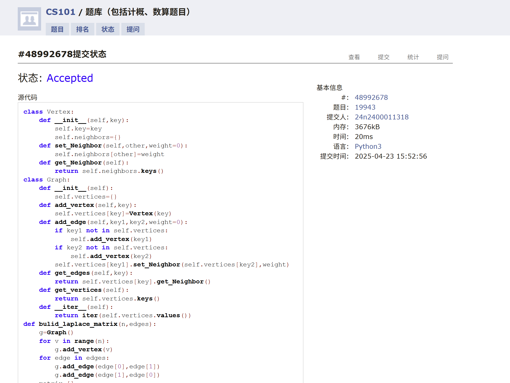
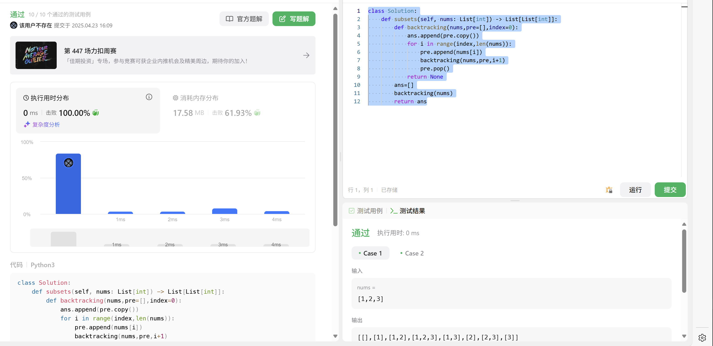
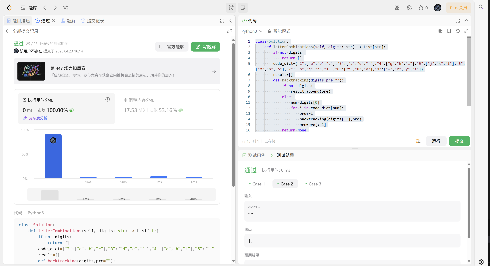
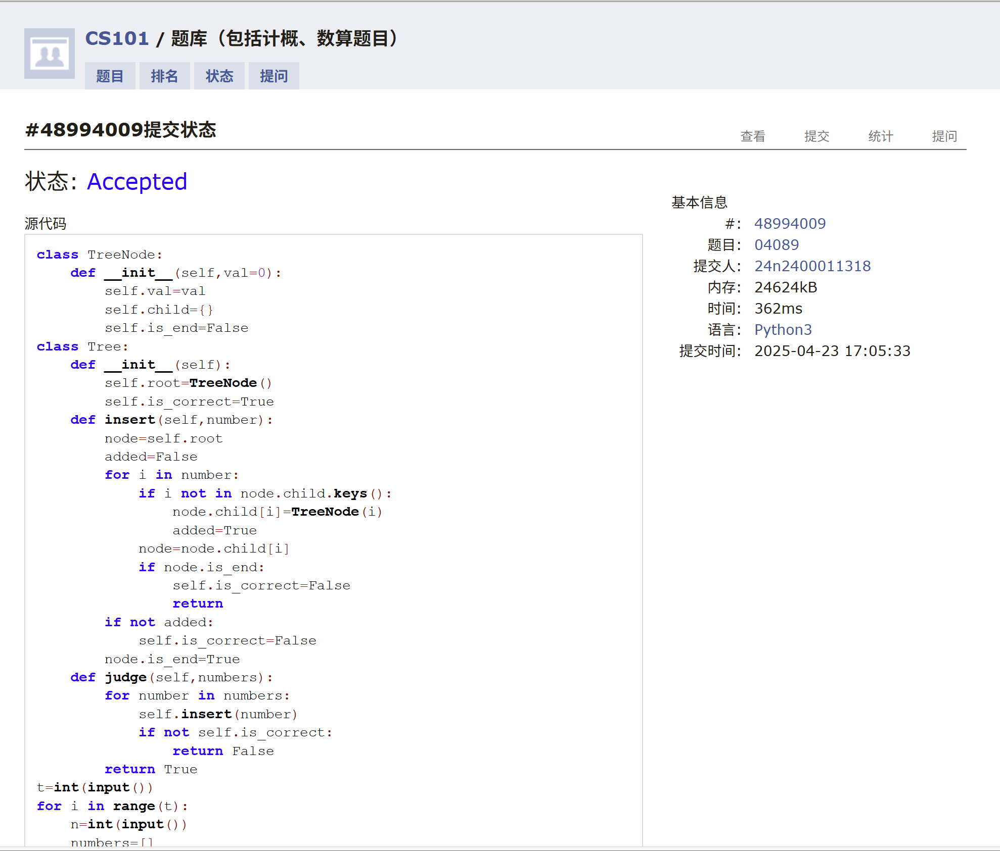
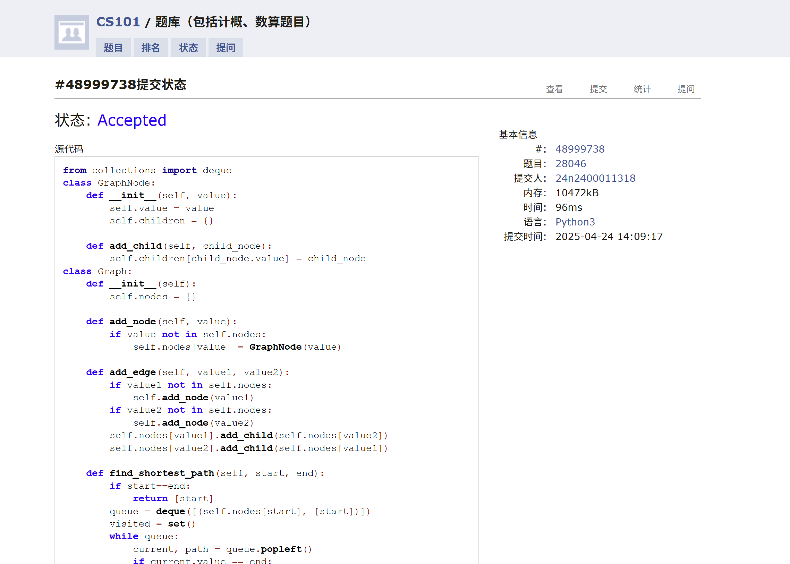
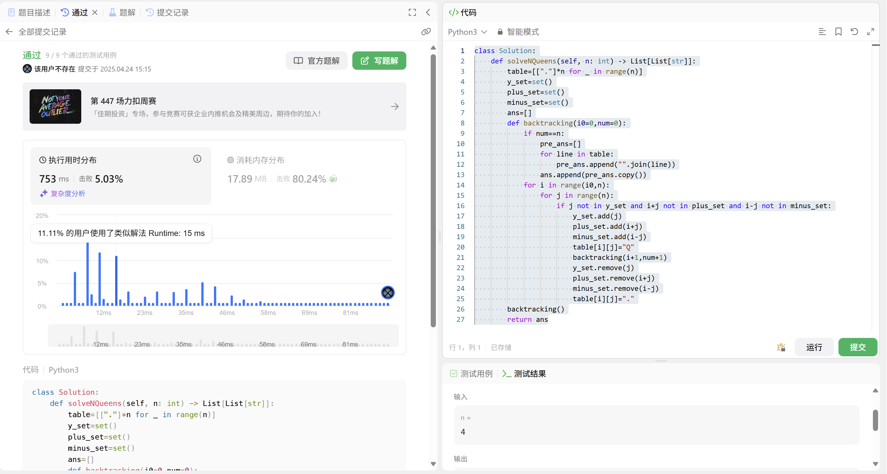

# Assignment #A: Graph starts

Updated 1830 GMT+8 Apr 22, 2025

2025 spring, Complied by 周博文---物理学院


> **说明：**
>
> 1. **解题与记录：**
>
>    对于每一个题目，请提供其解题思路（可选），并附上使用Python或C++编写的源代码（确保已在OpenJudge， Codeforces，LeetCode等平台上获得Accepted）。请将这些信息连同显示“Accepted”的截图一起填写到下方的作业模板中。（推荐使用Typora https://typoraio.cn 进行编辑，当然你也可以选择Word。）无论题目是否已通过，请标明每个题目大致花费的时间。
>
> 2. **提交安排：**提交时，请首先上传PDF格式的文件，并将.md或.doc格式的文件作为附件上传至右侧的“作业评论”区。确保你的Canvas账户有一个清晰可见的头像，提交的文件为PDF格式，并且“作业评论”区包含上传的.md或.doc附件。
>
> 3. **延迟提交：**如果你预计无法在截止日期前提交作业，请提前告知具体原因。这有助于我们了解情况并可能为你提供适当的延期或其他帮助。 
>
> 请按照上述指导认真准备和提交作业，以保证顺利完成课程要求。


## 1. 题目

### M19943:图的拉普拉斯矩阵

OOP, implementation, http://cs101.openjudge.cn/practice/19943/

要求创建Graph, Vertex两个类，建图实现。

思路：
课上讲的（不过好像两个类的功能没有讲义上的全）


代码：

```python
class Vertex:
    def __init__(self,key):
        self.key=key
        self.neighbors={}
    def set_Neighbor(self,other,weight=0):
        self.neighbors[other]=weight
    def get_Neighbor(self):
        return self.neighbors.keys()
class Graph:
    def __init__(self):
        self.vertices={}
    def add_vertex(self,key):
        self.vertices[key]=Vertex(key)
    def add_edge(self,key1,key2,weight=0):
        if key1 not in self.vertices:
            self.add_vertex(key1)
        if key2 not in self.vertices:
            self.add_vertex(key2)
        self.vertices[key1].set_Neighbor(self.vertices[key2],weight)
    def get_edges(self,key):
        return self.vertices[key].get_Neighbor()
    def get_vertices(self):
        return self.vertices.keys()
    def __iter__(self):
        return iter(self.vertices.values())
def bulid_laplace_matrix(n,edges):
    g=Graph()
    for v in range(n):
        g.add_vertex(v)
    for edge in edges:
        g.add_edge(edge[0],edge[1])
        g.add_edge(edge[1],edge[0])
    matrix=[]
    for u in g:
        row=[0]*n
        for v in u.neighbors.keys():
            row[v.key]-=1
            row[u.key]=len(u.neighbors)
        matrix.append(row)
    return matrix
n,m=[int(_) for _ in input().split()]
edges=[]
for _ in range(m):
    edges.append(list(map(int,input().split())))
laplace_matrix=bulid_laplace_matrix(n,edges)
for row in laplace_matrix:
    print(*row)
    
```


代码运行截图 <mark>（至少包含有"Accepted"）</mark>




### LC78.子集

backtracking, https://leetcode.cn/problems/subsets/

思路：
简单的回溯

代码：

```python
class Solution:
    def subsets(self, nums: List[int]) -> List[List[int]]:
        def backtracking(nums,pre=[],index=0):
            ans.append(pre.copy())
            for i in range(index,len(nums)):
                pre.append(nums[i])
                backtracking(nums,pre,i+1)
                pre.pop()
            return None
        ans=[]
        backtracking(nums)
        return ans
```


代码运行截图 <mark>（至少包含有"Accepted"）</mark>




### LC17.电话号码的字母组合

hash table, backtracking, https://leetcode.cn/problems/letter-combinations-of-a-phone-number/

思路：
字典+回溯，比较简单

代码：

```python
class Solution:
    def letterCombinations(self, digits: str) -> List[str]:
        if not digits:
            return []
        code_dict={"2":["a","b","c"],"3":["d","e","f"],"4":["g","h","i"],"5":["j","k","l"],"6":["m","n","o"],"7":["p","q","r","s"],"8":["t","u","v"],"9":["w","x","y","z"]}
        result=[]
        def backtracking(digits,pre=""):
            if not digits:
                result.append(pre)
            else:
                num=digits[0]
                for i in code_dict[num]:
                    pre+=i
                    backtracking(digits[1:],pre)
                    pre=pre[:-1]
            return None
        backtracking(digits)
        return result
```


代码运行截图 <mark>（至少包含有"Accepted"）</mark>




### M04089:电话号码

trie, http://cs101.openjudge.cn/practice/04089/

思路：
不用前缀树似乎更快。以及，卡了好久，结果发现问题出在输出的YES和NO只有首字母大写而没有全部大写。。。（也是无语住了）

代码：

```python
class TreeNode:
    def __init__(self,val=0):
        self.val=val
        self.child={}
        self.is_end=False
class Tree:
    def __init__(self):
        self.root=TreeNode()
        self.is_correct=True
    def insert(self,number):
        node=self.root
        added=False
        for i in number:
            if i not in node.child.keys():
                node.child[i]=TreeNode(i)
                added=True
            node=node.child[i]
            if node.is_end:
                self.is_correct=False
                return
        if not added:
            self.is_correct=False
        node.is_end=True
    def judge(self,numbers):
        for number in numbers:
            self.insert(number)
            if not self.is_correct:
                return False
        return True
t=int(input())
for i in range(t):
    n=int(input())
    numbers=[]
    for j in range(n):
        numbers.append(input().strip())
    tree=Tree()
    if tree.judge(numbers):
        print("YES")
    else:
        print("NO")
```


代码运行截图 <mark>（至少包含有"Accepted"）</mark>



### T28046:词梯

bfs, http://cs101.openjudge.cn/practice/28046/

思路：
难点主要在建图，直接用了课上讲的按照三个重复字符的规则“装筐”的方式，确实好写；同时从中新学会了字典的.setdefault的方法，可以用来初始化字典的值；然后bfs，用队列，每次取出一个节点，然后遍历它的所有邻居，如果邻居没有被访问过，则加入队列，同时标记为已访问；如果邻居是目标节点，则返回结果；如果遍历完所有邻居都没有找到目标节点，则返回None

虽然代码长，这道题调出来还算比较顺利的，几乎是一遍过的，可能是因为还是比较套路化的；但完整的写出来花的时间还是不少的，不知道考试时写图是否还要从头到尾纯手工实现，如果要的话需要提高套路化代码的熟练度和一遍调通的准确度

代码：

```python
from collections import deque
class GraphNode:
    def __init__(self, value):
        self.value = value
        self.children = {}

    def add_child(self, child_node):
        self.children[child_node.value] = child_node
class Graph:
    def __init__(self):
        self.nodes = {}

    def add_node(self, value):
        if value not in self.nodes:
            self.nodes[value] = GraphNode(value)

    def add_edge(self, value1, value2):
        if value1 not in self.nodes:
            self.add_node(value1)
        if value2 not in self.nodes:
            self.add_node(value2)
        self.nodes[value1].add_child(self.nodes[value2])
        self.nodes[value2].add_child(self.nodes[value1])

    def find_shortest_path(self, start, end):
        if start==end:
            return [start]
        queue = deque([(self.nodes[start], [start])])
        visited = set()
        while queue:
            current, path = queue.popleft()
            if current.value == end:
                return path
            if current.value not in visited:
                visited.add(current.value)
                for child in current.children.values():
                    queue.append((child, path + [child.value]))
        return None
def bulid_graph(words):
    graph = Graph()
    buckets={}
    for word in words:
        for i in range(len(word)):
            bucket=f"{word[:i]}_{word[i+1:]}"
            buckets.setdefault(bucket, set()).add(word)
    for bucket, words in buckets.items():
        for i in words:
            for j in words:
                if i != j:
                    graph.add_edge(i, j)
    return graph
n=int(input())
words = [input() for _ in range(n)]
graph = bulid_graph(words)
start, end = input().split()
if start not in graph.nodes.keys() or end not in graph.nodes.keys():
    print("NO")
else:
    path = graph.find_shortest_path(start, end)
    if path:
        print(" ".join(path))
    else:
        print("NO")
```


代码运行截图 <mark>（至少包含有"Accepted"）</mark>




### T51.N皇后

backtracking, https://leetcode.cn/problems/n-queens/

思路：

用集合记录j,i+j,i-j，每次尝试放置一个皇后时，检查是否与集合中的元素冲突，如果冲突则跳过，否则放置皇后并更新集合，然后递归调用backtracking，如果递归调用返回了结果，则返回结果，否则回溯，移除皇后并更新集合

然而，尽管思路基本相同，但是我的代码比标答慢很多，原因主要是： 我并没有考虑到放置n个皇后（而不是更少）导致每一行必然有且仅有一个皇后来剪枝，因此我的代码在时间上浪费了很多。

同时标答更好之处在于：我使用了二维数组来表示棋盘，而标答考虑到每一行只能放置一个皇后，因此使用了一维数组表示位置，同时封装一个函数输出答案而不是像我这样遍历数组deepcopy，因此我的代码在空间和时间上都有所浪费

代码：

```python
class Solution:
    def solveNQueens(self, n: int) -> List[List[str]]:
        table=[["."]*n for _ in range(n)]
        y_set=set()
        plus_set=set()
        minus_set=set()
        ans=[]
        def backtracking(i0=0,num=0):
            if num==n:
                pre_ans=[]
                for line in table:
                    pre_ans.append("".join(line))
                ans.append(pre_ans.copy())
            for i in range(i0,n):
                for j in range(n):
                    if j not in y_set and i+j not in plus_set and i-j not in minus_set:
                        y_set.add(j)
                        plus_set.add(i+j)
                        minus_set.add(i-j)
                        table[i][j]="Q"
                        backtracking(i+1,num+1)
                        y_set.remove(j)
                        plus_set.remove(i+j)
                        minus_set.remove(i-j)
                        table[i][j]="."
        backtracking()
        return ans
```


代码运行截图 <mark>（至少包含有"Accepted"）</mark>




## 2. 学习总结和收获

学习了图的基础知识，之前基本上没碰过图的题。感觉图的题普遍相对套路化，但是很繁琐，实际考试可能会需要较高的熟练度。

每日选做又鸽了（）课业压力稍微有点大，等五一把遗留的其他科目的任务补完再继续做每日选做吧（感觉不太可能做完了，应该只能选做一些比较难的）

又：祝大家节日快乐！


