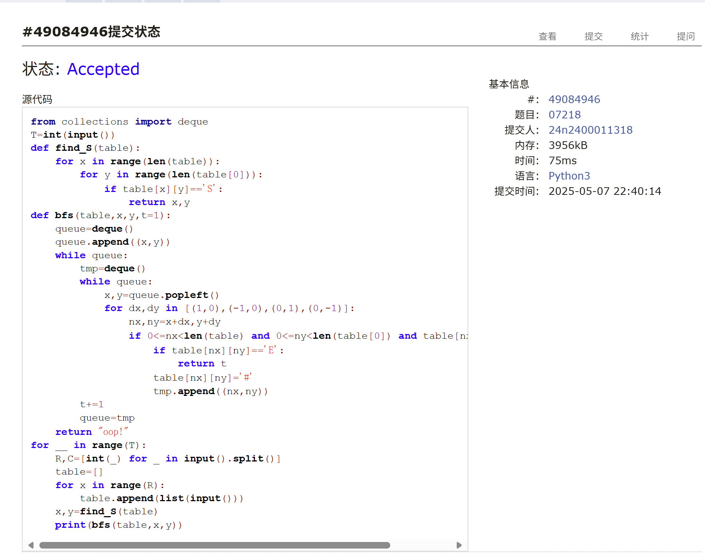
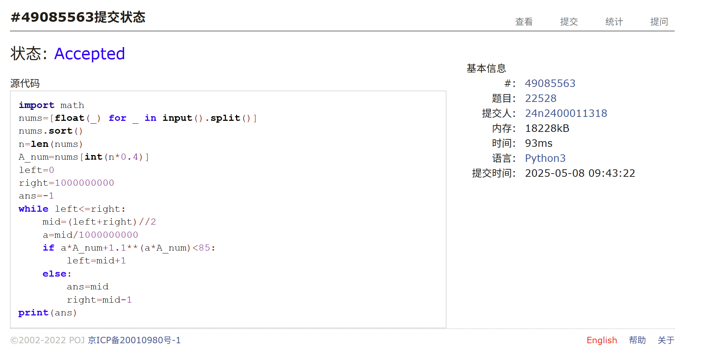
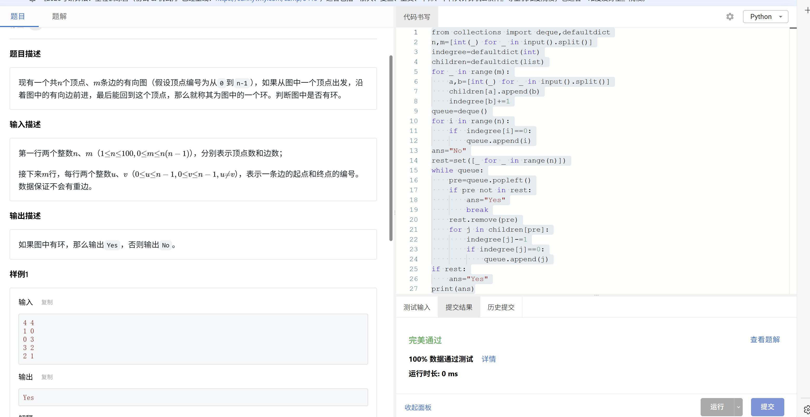
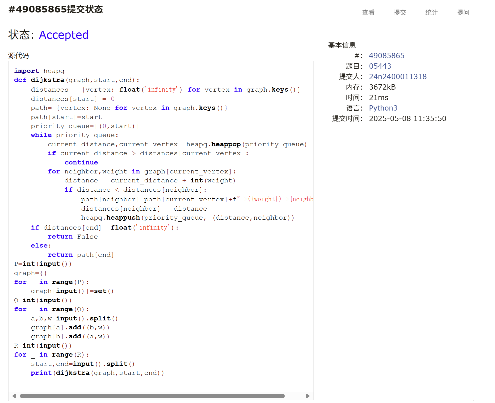
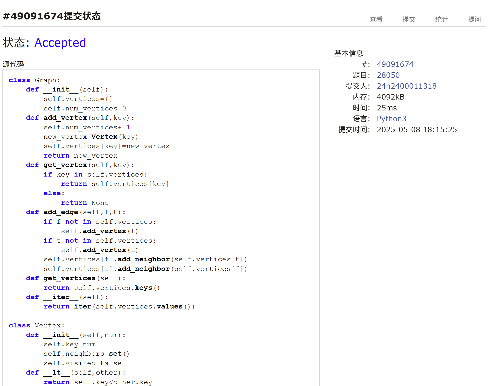

# Assignment #B: 图为主

Updated 2223 GMT+8 Apr 29, 2025

2025 spring, Complied by 周博文——物理学院


> **说明：**
>
> 1. **解题与记录：**
>
>    对于每一个题目，请提供其解题思路（可选），并附上使用Python或C++编写的源代码（确保已在OpenJudge， Codeforces，LeetCode等平台上获得Accepted）。请将这些信息连同显示“Accepted”的截图一起填写到下方的作业模板中。（推荐使用Typora https://typoraio.cn 进行编辑，当然你也可以选择Word。）无论题目是否已通过，请标明每个题目大致花费的时间。
>
> 2. **提交安排：**提交时，请首先上传PDF格式的文件，并将.md或.doc格式的文件作为附件上传至右侧的“作业评论”区。确保你的Canvas账户有一个清晰可见的头像，提交的文件为PDF格式，并且“作业评论”区包含上传的.md或.doc附件。
>
> 3. **延迟提交：**如果你预计无法在截止日期前提交作业，请提前告知具体原因。这有助于我们了解情况并可能为你提供适当的延期或其他帮助。 
>
> 请按照上述指导认真准备和提交作业，以保证顺利完成课程要求。


## 1. 题目

### E07218:献给阿尔吉侬的花束

bfs, http://cs101.openjudge.cn/practice/07218/

思路：
题目标题好评！原著很有意思！


代码：

```python
from collections import deque
T=int(input())
def find_S(table):
    for x in range(len(table)):
        for y in range(len(table[0])):
            if table[x][y]=='S':
                return x,y
def bfs(table,x,y,t=1):
    queue=deque()
    queue.append((x,y))
    while queue:
        tmp=deque()
        while queue:
            x,y=queue.popleft()
            for dx,dy in [(1,0),(-1,0),(0,1),(0,-1)]:
                nx,ny=x+dx,y+dy
                if 0<=nx<len(table) and 0<=ny<len(table[0]) and table[nx][ny]!='#':
                    if table[nx][ny]=='E':
                        return t
                    table[nx][ny]='#'
                    tmp.append((nx,ny))
        t+=1
        queue=tmp
    return "oop!"
for __ in range(T):
    R,C=[int(_) for _ in input().split()]
    table=[]
    for x in range(R):
        table.append(list(input()))
    x,y=find_S(table)
    print(bfs(table,x,y))
```


代码运行截图 <mark>（至少包含有"Accepted"）</mark>



### M3532.针对图的路径存在性查询I

disjoint set, https://leetcode.cn/problems/path-existence-queries-in-a-graph-i/

思路：
并查集+剪枝，显然不拿并查集做更简单而且省时间。。。


代码：

```python
class Solution:
    def pathExistenceQueries(self, n: int, nums: List[int], maxDiff: int, queries: List[List[int]]) -> List[bool]:
        class Union_search:
            def __init__(self,n):
                self.size = [1] * n
                self.parent = [i for i in range(n)]
            def find(self,i):
                if self.parent[i]!=i:
                     self.parent[i] = self.find(self.parent[i])
                return self.parent[i]
            def union_by_size(self,i,j):
                i_rep=self.find(i)
                j_rep=self.find(j)
                if i_rep==j_rep:
                    return None
                else:
                    if self.size[i_rep]<self.size[j_rep]:
                        self.parent[i_rep]=j_rep
                        self.size[j_rep]+=i_rep
                    else:
                        self.parent[j_rep]=i_rep
                        self.size[i_rep]+=j_rep
        union=Union_search(n)
        i=0
        while i<n:
            for j in range(i+1,n):
                if abs(nums[j]-nums[i])<=maxDiff:
                    union.union_by_size(i,j)
                    if j==n-1:
                        i=n
                else:
                    i=max(i,j-2)
                    break
            i+=1

        ans=[]
        for i,j in queries:
            if union.find(i)==union.find(j):
                ans.append(True)
            else:
                ans.append(False)
        return ans
```


代码运行截图 <mark>（至少包含有"Accepted"）</mark>


### M22528:厚道的调分方法

binary search, http://cs101.openjudge.cn/practice/22528/

思路：
简单的二分查找

代码：

```python
import math
nums=[float(_) for _ in input().split()]
nums.sort()
n=len(nums)
A_num=nums[int(n*0.4)]
left=0
right=1000000000
ans=-1
while left<=right:
    mid=(left+right)//2
    a=mid/1000000000
    if a*A_num+1.1**(a*A_num)<85:
        left=mid+1
    else:
        ans=mid
        right=mid-1
print(ans)
```


代码运行截图 <mark>（至少包含有"Accepted"）</mark>



### Msy382: 有向图判环 

dfs, https://sunnywhy.com/sfbj/10/3/382

思路：
因为之前没学过拓扑排序，选择现学了一下然后拿拓扑排序写


代码：

```python
from collections import deque,defaultdict
n,m=[int(_) for _ in input().split()]
indegree=defaultdict(int)
children=defaultdict(list)
for _ in range(m):
    a,b=[int(_) for _ in input().split()]
    children[a].append(b)
    indegree[b]+=1
queue=deque()
for i in range(n):
    if  indegree[i]==0:
        queue.append(i)
ans="No"
rest=set([_ for _ in range(n)])
while queue:
    pre=queue.popleft()
    if pre not in rest:
        ans="Yes"
        break
    rest.remove(pre)
    for j in children[pre]:
        indegree[j]-=1
        if indegree[j]==0:
            queue.append(j)
if rest:
    ans="Yes"
print(ans)
```


代码运行截图 <mark>（至少包含有"Accepted"）</mark>



### M05443:兔子与樱花

Dijkstra, http://cs101.openjudge.cn/practice/05443/

思路：
现学的Dijkstra，修改之处在于，用一个字典记录当前节点到起点具有最短距离的路径，返回终点对应的路径即可

代码：

```python
import heapq
def dijkstra(graph,start,end):
    distances = {vertex: float('infinity') for vertex in graph.keys()}
    distances[start] = 0
    path= {vertex: None for vertex in graph.keys()}
    path[start]=start
    priority_queue=[(0,start)]
    while priority_queue:
        current_distance,current_vertex= heapq.heappop(priority_queue)
        if current_distance > distances[current_vertex]:
            continue
        for neighbor,weight in graph[current_vertex]:
            distance = current_distance + int(weight)
            if distance < distances[neighbor]:
                path[neighbor]=path[current_vertex]+f"->({weight})->{neighbor}"
                distances[neighbor] = distance
                heapq.heappush(priority_queue, (distance,neighbor))
    if distances[end]==float('infinity'):
        return False
    else:
        return path[end]
P=int(input())
graph={}
for _ in range(P):
    graph[input()]=set()
Q=int(input())
for _ in range(Q):
    a,b,w=input().split()
    graph[a].add((b,w))
    graph[b].add((a,w))
R=int(input())
for _ in range(R):
    start,end=input().split()
    print(dijkstra(graph,start,end))


```


代码运行截图 <mark>（至少包含有"Accepted"）</mark>



### T28050: 骑士周游

dfs, http://cs101.openjudge.cn/practice/28050/

思路：
按照课件中的思路，用优化后的dfs写

代码：

```python
class Graph:
    def __init__(self):
        self.vertices={}
        self.num_vertices=0
    def add_vertex(self,key):
        self.num_vertices+=1
        new_vertex=Vertex(key)
        self.vertices[key]=new_vertex
        return new_vertex
    def get_vertex(self,key):
        if key in self.vertices:
            return self.vertices[key]
        else:
            return None
    def add_edge(self,f,t):
        if f not in self.vertices:
            self.add_vertex(f)
        if t not in self.vertices:
            self.add_vertex(t)
        self.vertices[f].add_neighbor(self.vertices[t])
        self.vertices[t].add_neighbor(self.vertices[f])
    def get_vertices(self):
        return self.vertices.keys()
    def __iter__(self):
        return iter(self.vertices.values())
    
class Vertex:
    def __init__(self,num):
        self.key=num
        self.neighbors=set()
        self.visited=False
    def __lt__(self,other):
        return self.key<other.key
    def add_neighbor(self,neighbor):
        self.neighbors.add(neighbor)
    def get_neighbors(self):
        return self.neighbors
def next_legal_steps(size,row,col):
    steps=[(2,1),(2,-1),(-2,1),(-2,-1),(1,2),(1,-2),(-1,2),(-1,-2)]
    legal_steps=[]
    for step in steps:
        new_row=row+step[0]
        new_col=col+step[1]
        if 0<=new_row<size and 0<=new_col<size:
            legal_steps.append((new_row,new_col))
    return legal_steps
def knight_graph(size):
    graph=Graph()
    for row in range(size):
        for col in range(size):
            id=row*n+col
            new_postions=next_legal_steps(size,row,col)
            for pos in new_postions:
                nid=pos[0]*n+pos[1]
                graph.add_edge(id,nid)
    return graph
def order_avaliable(n):
    res_list = []
    for v in n.get_neighbors():
        if v.visited==False:
            c=0
            for w in v.get_neighbors():
                if w.visited==False:
                    c += 1
            res_list.append((c,v))
    res_list.sort(key=lambda x:x[0])
    return [y[1] for y in res_list]

def knight_tour(lenth,path,pre,max_length):
    if lenth==max_length:
        return True
    path.append(pre)
    pre.visited=True
    ordered_neighbors=order_avaliable(pre)
    for next_node in ordered_neighbors:
        if next_node.visited==False and knight_tour(lenth+1,path,next_node,max_length):
            return True
    pre.visited=False
    path.pop()
    return False
n=int(input())
sr,sc=[int(_) for _ in input().split()]
graph=knight_graph(n)
if knight_tour(1,[],graph.get_vertex(sr*n+sc),n*n):
    print("success")
else:
    print("fail")
```


代码运行截图 <mark>（至少包含有"Accepted"）</mark>




## 2. 学习总结和收获

因为作业题中涉及的内容有部分之前没有接触过（上学期不是闫老师的计概班），所以花了点时间复习图的写法以及涉及图的几个没讲的算法。五一忙着赶其他科目作业以及出去玩了，加上要花时间看懂讲义，每日选做题没怎么做。


