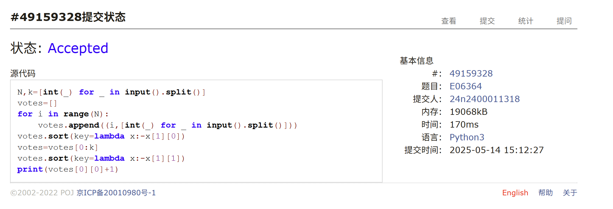
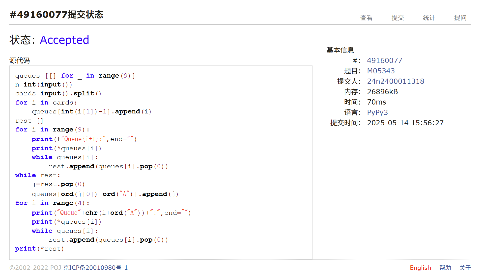
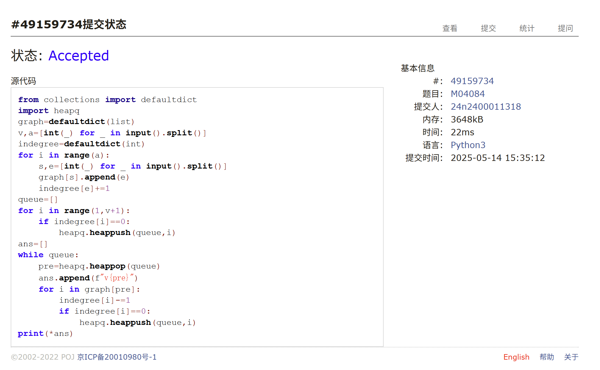
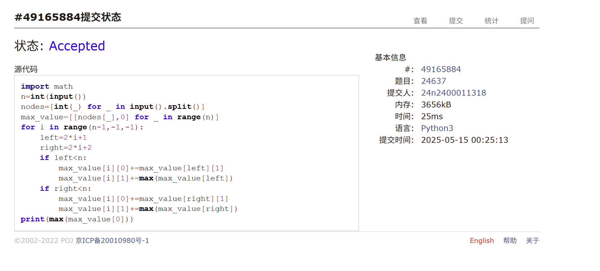

# Assignment #C: 202505114 Mock Exam

Updated 1518 GMT+8 May 14, 2025

2025 spring, Complied by 周博文——物理学院


> **说明：**
>
> 1. **⽉考**：AC4 。考试题⽬都在“题库（包括计概、数算题目）”⾥⾯，按照数字题号能找到，可以重新提交。作业中提交⾃⼰最满意版本的代码和截图。
>
> 2. **解题与记录：**
>
>    对于每一个题目，请提供其解题思路（可选），并附上使用Python或C++编写的源代码（确保已在OpenJudge， Codeforces，LeetCode等平台上获得Accepted）。请将这些信息连同显示“Accepted”的截图一起填写到下方的作业模板中。（推荐使用Typora https://typoraio.cn 进行编辑，当然你也可以选择Word。）无论题目是否已通过，请标明每个题目大致花费的时间。
>
> 3. **提交安排：**提交时，请首先上传PDF格式的文件，并将.md或.doc格式的文件作为附件上传至右侧的“作业评论”区。确保你的Canvas账户有一个清晰可见的头像，提交的文件为PDF格式，并且“作业评论”区包含上传的.md或.doc附件。
>
> 4. **延迟提交：**如果你预计无法在截止日期前提交作业，请提前告知具体原因。这有助于我们了解情况并可能为你提供适当的延期或其他帮助。 
>
> 请按照上述指导认真准备和提交作业，以保证顺利完成课程要求。


## 1. 题目

### E06364: 牛的选举

http://cs101.openjudge.cn/practice/06364/

思路：
简单的，不到10分钟


代码：

```python
N,k=[int(_) for _ in input().split()]
votes=[]
for i in range(N):
    votes.append((i,[int(_) for _ in input().split()]))
votes.sort(key=lambda x:-x[1][0])
votes=votes[0:k]
votes.sort(key=lambda x:-x[1][1])
print(votes[0][0]+1)
```


代码运行截图 <mark>（至少包含有"Accepted"）</mark>



### M04077: 出栈序列统计

http://cs101.openjudge.cn/practice/04077/

思路：
模拟进栈出栈，中途后第三个if写成elif写错稍微卡了一下，十多分钟


代码：

```python
n=int(input())
count=0
ans=0
def dfs(count,rest=n):
    global ans
    if rest==0 and count==0:
        ans+=1
        return None
    if rest>0:
        dfs(count+1,rest-1)
    if count>0:
        dfs(count-1,rest)
dfs(count)
print(ans)
```


代码运行截图 <mark>（至少包含有"Accepted"）</mark>


### M05343:用队列对扑克牌排序

http://cs101.openjudge.cn/practice/05343/

思路：
模拟题目过程即可，但似乎因为python版本问题一开始的输出语句在oj上报错了，稍微改了一会儿，十五分钟。

代码：

```python
queues=[[] for _ in range(9)]
n=int(input())
cards=input().split()
for i in cards:
    queues[int(i[1])-1].append(i)
rest=[]
for i in range(9):
    print(f"Queue{i+1}:",end="")
    print(*queues[i])
    while queues[i]:
        rest.append(queues[i].pop(0))
while rest:
    j=rest.pop(0)
    queues[ord(j[0])-ord("A")].append(j)
for i in range(4):
    print("Queue"+chr(i+ord("A"))+":",end="")
    print(*queues[i])
    while queues[i]:
        rest.append(queues[i].pop(0))
print(*rest)
```


代码运行截图 <mark>（至少包含有"Accepted"）</mark>


### M04084: 拓扑排序

http://cs101.openjudge.cn/practice/04084/

思路：
拓扑排序，但是要根据题目要求输出顺序，所以用堆来将目前入度为0的编号最小的节点输出，而不是直接输出。约15分钟


代码：

```python
from collections import defaultdict
import heapq
graph=defaultdict(list)
v,a=[int(_) for _ in input().split()]
indegree=defaultdict(int)
for i in range(a):
    s,e=[int(_) for _ in input().split()]
    graph[s].append(e)
    indegree[e]+=1
queue=[]
for i in range(1,v+1):
    if indegree[i]==0:
        heapq.heappush(queue,i)
ans=[]
while queue:
    pre=heapq.heappop(queue)
    ans.append(f"v{pre}")
    for i in graph[pre]:
        indegree[i]-=1
        if indegree[i]==0:
            heapq.heappush(queue,i)
print(*ans)
```


代码运行截图 <mark>（至少包含有"Accepted"）</mark>





### M07735:道路

Dijkstra, http://cs101.openjudge.cn/practice/07735/

思路：
相比于一般的Dijkstra，因为涉及费用不能只保留中间的最短路径，所以要记录每一条可能的路径导致一直TLE/MLE，尝试从当前节点最短路径及其费用/最小费用及其长度的角度剪枝，杯水车薪，挣扎了五十多分钟居然毫无头绪。。。。很经典的考完后立马会做，后来发现，只要检测是否已经到达终点并立刻跳出循环即可，除此之外完全不需要剪枝（怀疑测试样例中可能存在环，导致不这么处理会死循环超时？）

下次还是要注意时间控制，不要沉迷剪枝或细节优化，要时刻脑袋清楚抓住主要矛盾；以及，往后看别的题。

代码：

```python
from collections import defaultdict
import heapq
graph=defaultdict(list)
k=int(input())
n=int(input())
r=int(input())
for i in range(r):
    s,d,l,t=[int(_) for _ in input().split()]
    graph[s].append((d,l,t))
queue=[(0,k,1)]
while queue:
    lenth1,money,pre=heapq.heappop(queue)
    if pre==n:
        print(lenth1)
        break
    for pairs in graph[pre]:
        if money-pairs[2]>=0:
            heapq.heappush(queue,(lenth1+pairs[1],money-pairs[2],pairs[0]))
if pre!=n:
    print(-1)
```


代码运行截图 <mark>（至少包含有"Accepted"）</mark>


### T24637:宝藏二叉树

dp, http://cs101.openjudge.cn/practice/24637/

思路：
从树的下部往上，记录每个节点选或不选其本身的最大值，然后向上递推，输出根节点选或不选其本身的较大值

考试后做出来的，还是稍微花了点时间，因为忘了考虑不选某节点时，应该是左右两子树最大值的和，而不只是左右两节点都选时值的和，需要注意不能想当然。但感觉总体难度配不上T。

代码：

```python
import math
n=int(input())
nodes=[int(_) for _ in input().split()]
max_value=[[nodes[_],0] for _ in range(n)]
for i in range(n-1,-1,-1):
    left=2*i+1
    right=2*i+2
    if left<n:
        max_value[i][0]+=max_value[left][1]
        max_value[i][1]+=max(max_value[left])
    if right<n:
        max_value[i][0]+=max_value[right][1]
        max_value[i][1]+=max(max_value[right])
print(max(max_value[0]))
```


代码运行截图 <mark>（至少包含有"Accepted"）</mark>



## 2. 学习总结和收获
AC4（前四题），有点菜了，感觉主要问题还是在经验不足没有进行合理的时间分配，以及沉迷剪枝（而不是寻找并解决更主要的矛盾）无法自拔的老毛病；其实本来完全有可能AK的。离机考还有一个月了，打算先把之前讲义系统过一遍把算法整体复习一遍，然后多做题吧，希望机考能考好点。
