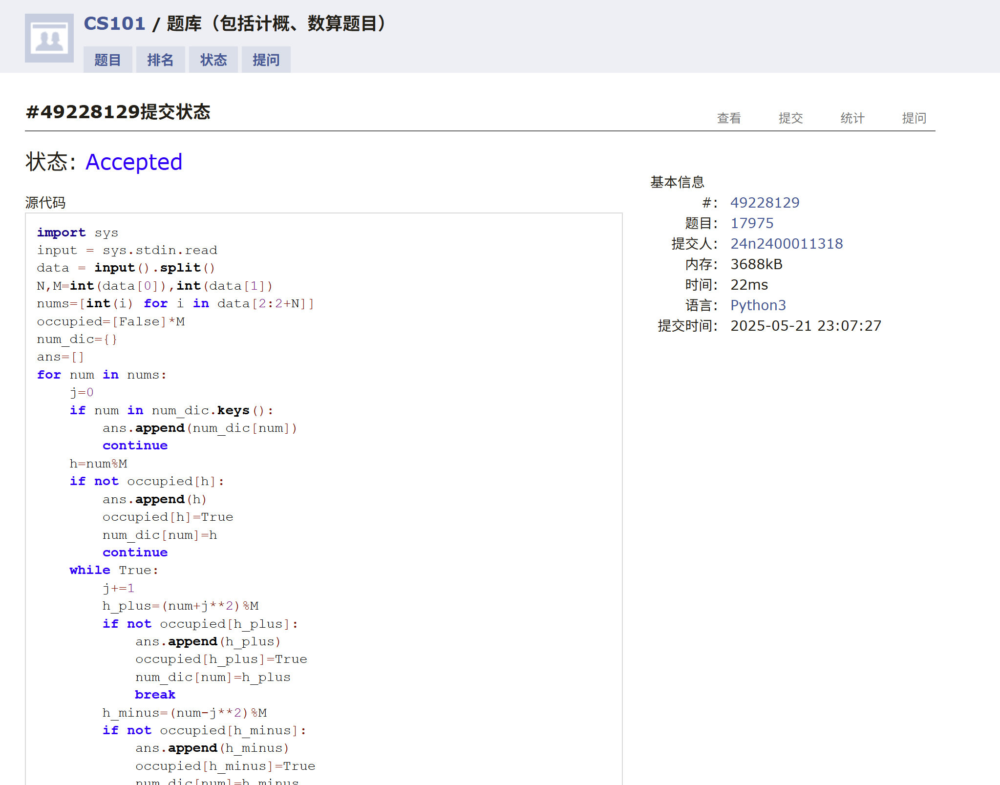
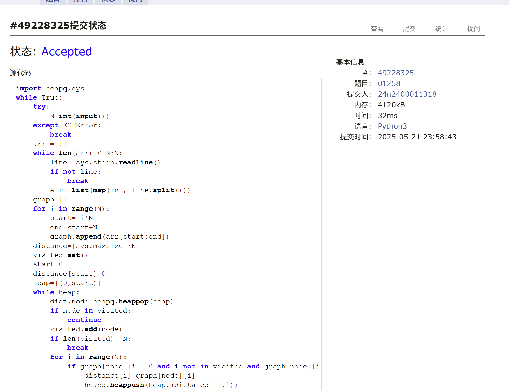
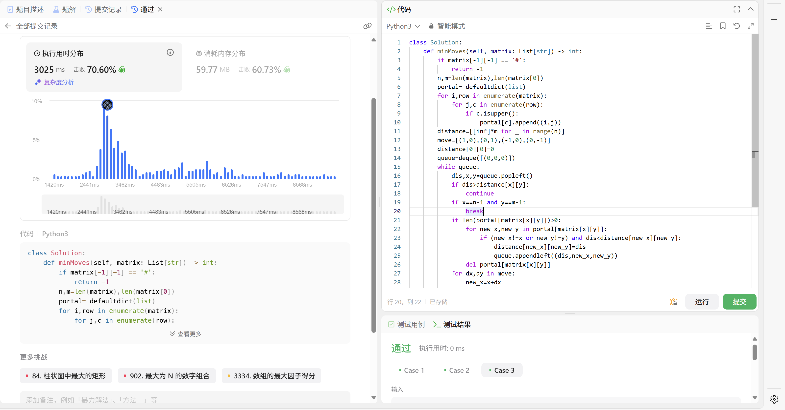
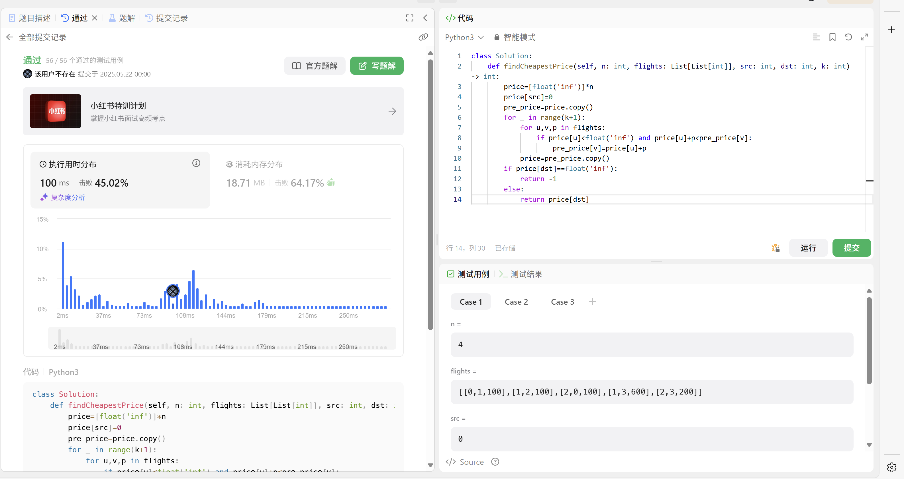
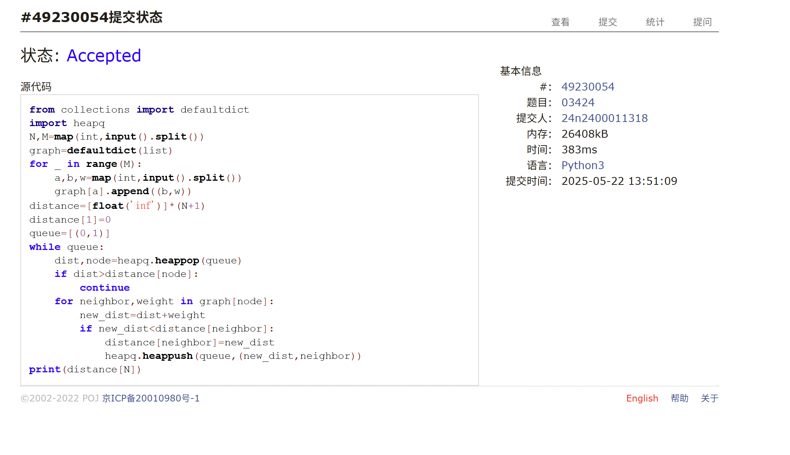
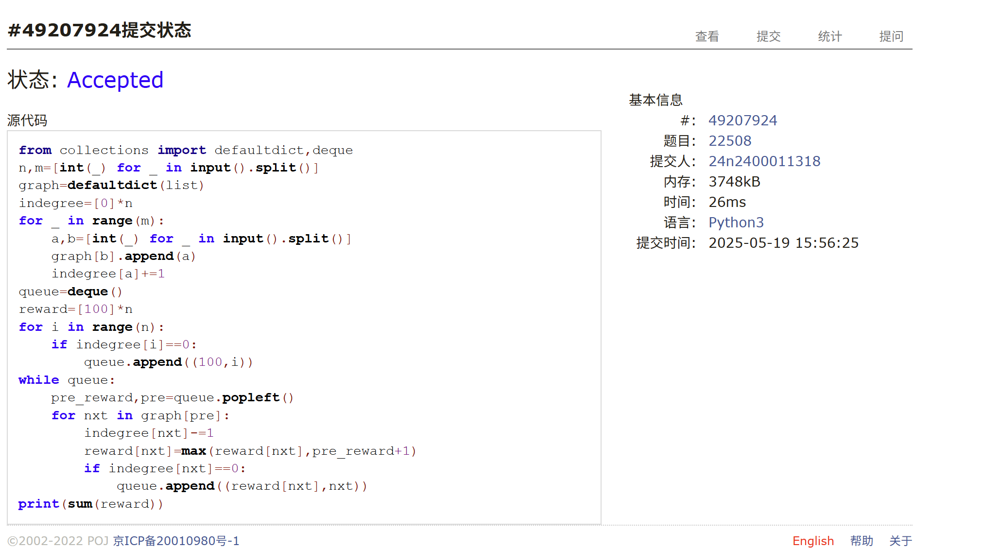

# Assignment #D: 图 & 散列表

Updated 2042 GMT+8 May 20, 2025

2025 spring, Complied by <mark>同学的姓名、院系</mark>


> **说明：**
>
> 1. **解题与记录：**
>
>    对于每一个题目，请提供其解题思路（可选），并附上使用Python或C++编写的源代码（确保已在OpenJudge， Codeforces，LeetCode等平台上获得Accepted）。请将这些信息连同显示“Accepted”的截图一起填写到下方的作业模板中。（推荐使用Typora https://typoraio.cn 进行编辑，当然你也可以选择Word。）无论题目是否已通过，请标明每个题目大致花费的时间。
>
> 2. **提交安排：**提交时，请首先上传PDF格式的文件，并将.md或.doc格式的文件作为附件上传至右侧的“作业评论”区。确保你的Canvas账户有一个清晰可见的头像，提交的文件为PDF格式，并且“作业评论”区包含上传的.md或.doc附件。
>
> 3. **延迟提交：**如果你预计无法在截止日期前提交作业，请提前告知具体原因。这有助于我们了解情况并可能为你提供适当的延期或其他帮助。 
>
> 请按照上述指导认真准备和提交作业，以保证顺利完成课程要求。


## 1. 题目

### M17975: 用二次探查法建立散列表

http://cs101.openjudge.cn/practice/17975/

<mark>需要用这样接收数据。因为输入数据可能分行了，不是题面描述的形式。OJ上面有的题目是给C++设计的，细节考虑不周全。</mark>

```python
import sys
input = sys.stdin.read
data = input().split()
index = 0
n = int(data[index])
index += 1
m = int(data[index])
index += 1
num_list = [int(i) for i in data[index:index+n]]
```


思路：
唯一难点在输入格式，严格按照题目意思做即可

代码：

```python
import sys
input = sys.stdin.read
data = input().split()
N,M=int(data[0]),int(data[1])
nums=[int(i) for i in data[2:2+N]]
occupied=[False]*M
num_dic={}
ans=[]
for num in nums:
    j=0
    if num in num_dic.keys():
        ans.append(num_dic[num])
        continue
    h=num%M
    if not occupied[h]:
        ans.append(h)
        occupied[h]=True
        num_dic[num]=h
        continue
    while True:
        j+=1
        h_plus=(num+j**2)%M
        if not occupied[h_plus]:
            ans.append(h_plus)
            occupied[h_plus]=True
            num_dic[num]=h_plus
            break
        h_minus=(num-j**2)%M
        if not occupied[h_minus]:
            ans.append(h_minus)
            occupied[h_minus]=True
            num_dic[num]=h_minus
            break
print(*ans)
```


代码运行截图 <mark>（至少包含有"Accepted"）</mark>




### M01258: Agri-Net

MST, http://cs101.openjudge.cn/practice/01258/

思路：
抽象题目，难点居然在输入，无语住了。


代码：

```python
import heapq,sys
while True:
    try:
        N=int(input())
    except EOFError:
        break
    arr = []
    while len(arr) < N*N:
        line= sys.stdin.readline()
        if not line:
            break
        arr+=list(map(int, line.split()))        
    graph=[]
    for i in range(N):
        start= i*N
        end=start+N
        graph.append(arr[start:end])
    distance=[sys.maxsize]*N
    visited=set()
    start=0
    distance[start]=0
    heap=[(0,start)]
    while heap:
        dist,node=heapq.heappop(heap)
        if node in visited:
            continue
        visited.add(node)
        if len(visited)==N:
            break
        for i in range(N):
            if graph[node][i]!=0 and i not in visited and graph[node][i]<distance[i]:
                distance[i]=graph[node][i]
                heapq.heappush(heap,(distance[i],i))
    print(sum(distance))
```


代码运行截图 <mark>（至少包含有"Accepted"）</mark>





### M3552.网络传送门旅游

bfs, https://leetcode.cn/problems/grid-teleportation-traversal/

思路：

很像Dijkstra，但由于每次只走一步，所以只需要用队列，然后通过使用传送门时加在左边，不使用时加在右边，来实现优先队列的效果。

代码：

```python
class Solution:
    def minMoves(self, matrix: List[str]) -> int:
        if matrix[-1][-1] == '#':
            return -1
        n,m=len(matrix),len(matrix[0])
        portal= defaultdict(list)
        for i,row in enumerate(matrix):
            for j,c in enumerate(row):
                if c.isupper():
                    portal[c].append((i,j))
        distance=[[inf]*m for _ in range(n)]
        move=[(1,0),(0,1),(-1,0),(0,-1)]
        distance[0][0]=0
        queue=deque([(0,0,0)])
        while queue:
            dis,x,y=queue.popleft()
            if dis>distance[x][y]:
                continue
            if x==n-1 and y==m-1:
                break
            if len(portal[matrix[x][y]])>0:
                for new_x,new_y in portal[matrix[x][y]]:
                    if (new_x!=x or new_y!=y) and dis<distance[new_x][new_y]:
                        distance[new_x][new_y]=dis
                        queue.appendleft((dis,new_x,new_y))
                del portal[matrix[x][y]]
            for dx,dy in move:
                new_x=x+dx
                new_y=y+dy
                if 0<=new_x<n and 0<=new_y<m and matrix[new_x][new_y]!="#" and dis+1<distance[new_x][new_y]:
                    distance[new_x][new_y]=dis+1
                    queue.append((dis+1,new_x,new_y))
        if distance[-1][-1]<inf:
            return distance[-1][-1]
        else:
            return -1
```


代码运行截图 <mark>（至少包含有"Accepted"）</mark>





### M787.K站中转内最便宜的航班

Bellman Ford, https://leetcode.cn/problems/cheapest-flights-within-k-stops/

思路：
简单题，Bellman Ford但只松弛k+1次


代码：

```python
class Solution:
    def findCheapestPrice(self, n: int, flights: List[List[int]], src: int, dst: int, k: int) -> int:
        price=[float('inf')]*n
        price[src]=0
        pre_price=price.copy()
        for _ in range(k+1):
            for u,v,p in flights:
                if price[u]<float('inf') and price[u]+p<pre_price[v]:
                    pre_price[v]=price[u]+p
            price=pre_price.copy()
        if price[dst]==float('inf'):
            return -1
        else:
            return price[dst]
```


代码运行截图 <mark>（至少包含有"Accepted"）</mark>



### M03424: Candies

Dijkstra, http://cs101.openjudge.cn/practice/03424/

思路：
dijkstra；个人理解，任意两点之间的最大差，等于最短路径上，从一个节点到另一个节点逐节点递增地取到差的最大值，原因是：1、任意两点之间最大差值必定受最短升序路径的约束，2、在最短升序路径下，其他节点间约束条件必定满足，否则意味着存在更短的升序路径，与最短路径矛盾。

代码：

```python
from collections import defaultdict
import heapq
N,M=map(int,input().split())
graph=defaultdict(list)
for _ in range(M):
    a,b,w=map(int,input().split())
    graph[a].append((b,w))
distance=[float('inf')]*(N+1)
distance[1]=0
queue=[(0,1)]
while queue:
    dist,node=heapq.heappop(queue)
    if dist>distance[node]:
        continue
    for neighbor,weight in graph[node]:
        new_dist=dist+weight
        if new_dist<distance[neighbor]:
            distance[neighbor]=new_dist
            heapq.heappush(queue,(new_dist,neighbor))
print(distance[N])
```


代码运行截图 <mark>（至少包含有"Accepted"）</mark>




### M22508:最小奖金方案

topological order, http://cs101.openjudge.cn/practice/22508/

思路：
拓扑排序，入度为0的队伍奖金取最低，然后逐个取出，奖金递增步长为1


代码：

```python
from collections import defaultdict,deque
n,m=[int(_) for _ in input().split()]
graph=defaultdict(list)
indegree=[0]*n
for _ in range(m):
    a,b=[int(_) for _ in input().split()]
    graph[b].append(a)
    indegree[a]+=1
queue=deque()
reward=[100]*n
for i in range(n):
    if indegree[i]==0:
        queue.append((100,i))
while queue:
    pre_reward,pre=queue.popleft()
    for nxt in graph[pre]:
        indegree[nxt]-=1
        reward[nxt]=max(reward[nxt],pre_reward+1)
        if indegree[nxt]==0:
            queue.append((reward[nxt],nxt))
print(sum(reward))
```


代码运行截图 <mark>（至少包含有"Accepted"）</mark>




## 2. 学习总结和收获

作业确实比较简单。临近期末/机考了，最近开始补之前落下的每日选做，感觉做题速度和准确率已经有了明显的提高。希望机考能AC5以上😭


